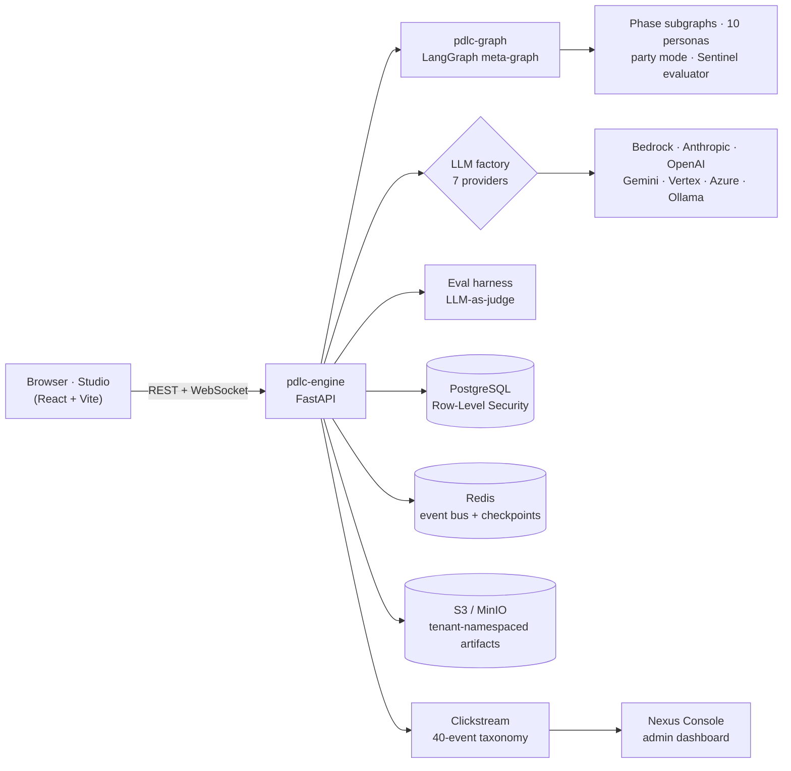

# pdlcflow

**Run your product development lifecycle as a team of AI agents — from raw idea to shipped feature.**

pdlcflow is an open-source, multi-tenant platform that turns a structured Product Development
Lifecycle (PDLC) into a browser-based, multi-agent system. A cast of specialized AI agents
moves each feature through **brainstorm → build → ship**, with human approval gates, persistent
memory, automatic quality evaluation, and full audit telemetry. It runs on **your choice of
LLM provider**, self-hosted or on AWS, with tenant isolation enforced at the database.

[](./LICENSE)
[](https://github.com/pdlc-os/pdlcflow/releases)
[](https://github.com/pdlc-os/pdlcflow/actions/workflows/ci.yml)
[](https://www.python.org/)
[](https://github.com/langchain-ai/langgraph)

---

## Table of contents

- [Why pdlcflow](#why-pdlcflow)
- [Highlights](#highlights)
- [Bring your own LLM](#bring-your-own-llm)
- [Architecture](#architecture)
- [Quickstart](#quickstart)
- [Configuration](#configuration)
- [Documentation](#documentation)
- [Relationship to upstream `pdlc`](#relationship-to-upstream-pdlc)
- [Repository layout](#repository-layout)
- [Testing & CI](#testing--ci)
- [Contributing](#contributing)
- [Security](#security)
- [License](#license)

## Why pdlcflow

Most "AI coding" tools help with a single step. pdlcflow operationalizes the **whole
lifecycle**: it encodes a proven, phase-based methodology — discovery, definition, design,
build, review, and ship — and runs it as a coordinated team of role-specialized agents with
the guardrails a real organization needs.

- **For leaders:** a consistent, auditable path from idea to production. Every decision, gate,
  and agent action is captured as clickstream telemetry and surfaced in an admin dashboard, so
  you can see cost, throughput, and quality across teams — with cost controls and
  human-in-the-loop approvals built in.
- **For engineers:** a hackable, well-tested runtime. A Python [LangGraph](https://github.com/langchain-ai/langgraph)
  engine, a FastAPI service, and a React UI — all behind clean, swappable ports (LLM, storage,
  queue, telemetry) so you can run it on a laptop or scale it to a multi-tenant SaaS.

## Highlights

- **End-to-end lifecycle** — four phases, ~17 commands, and **10 specialized agent personas**
  collaborating through the work, including multi-agent **"party" meetings** for divergent
  ideation and adversarial review.
- **Human-in-the-loop governance** — **8 approval gates**, a Socratic interaction mode, and a
  **3-Strike escalation** protocol keep humans in control of consequential decisions.
- **Autonomy when you want it** — a `/night-shift` loop advances work unattended within
  guardrails, with episode reports for everything it did.
- **Bring your own LLM** — a 7-provider factory (Bedrock, Anthropic, OpenAI, Google Gemini,
  Vertex AI, Azure OpenAI, Ollama) selectable per deployment, with a deterministic offline
  stub for hermetic dev and CI.
- **Quality you can measure** — a built-in **evaluation harness** scores agent output at major
  steps: per-agent quality, groundedness / hallucination, citation & faithful-relay, spec
  adherence, production-safety, plus drift/regression tracking and nightly real-LLM evals.
- **Multi-tenant by design** — JWT authentication, role-based admin, and **PostgreSQL
  Row-Level Security (FORCE)** so tenant isolation is enforced by the database — not just the
  app. Artifacts (PRDs, design docs, reviews) are namespaced per tenant.
- **Observability built in** — a 40-event clickstream taxonomy feeds analytics and the **Atlas
  Console** admin dashboard (live runs, cost/usage rollups, per-agent metrics).
- **Live experience** — a React **Studio** with real-time WebSocket updates and live token
  "drafting" previews.
- **Deploy anywhere** — one-line install from published container images, Docker Compose for
  self-host, or AWS CDK (8 stacks) for multi-tenant SaaS.
- **Migration tooling** — a CLI to scan, map, and back-fill from an existing PDLC setup.

## Bring your own LLM

pdlcflow is **provider-neutral**. Persona completions, the eval judge, and token streaming all
flow through one pluggable LLM factory; pick the backend per deployment with a single setting
(`PDLC_DEFAULT_LLM_PROVIDER`) and supply that provider's credentials.

| Provider | Key | Notes |
| --- | --- | --- |
| **AWS Bedrock** | `bedrock` | Default; uses your AWS credentials/region |
| **Anthropic** | `anthropic` | Direct Claude API |
| **OpenAI** | `openai` | GPT models |
| **Google Gemini** | `gemini` | Gemini API |
| **Google Vertex AI** | `vertex` | Gemini/Claude on GCP |
| **Azure OpenAI** | `azure` | Azure-hosted OpenAI |
| **Ollama** | `ollama` | Local / air-gapped models |

Agents stay provider-neutral by declaring a **capability tier** (`premium` = highest
capability, `balanced` = general purpose, `economy` = low token / fast) rather than a model.
The factory maps the tier to the right model for the active provider — Anthropic-family
providers keep real Opus/Sonnet/Haiku, while OpenAI/Gemini auto-select their
highest/general/economy equivalent — so switching providers preserves each agent's intended
capability level. Defaults are overridable per tenant or per agent (see the
[configuration guide](./docs/wiki/03-configuration.md#per-agent-model-tiers-provider-neutral)).

Leave the LLM unwired (`PDLC_WIRE_LLM=false`, the default) and pdlcflow runs against a
deterministic offline stub — so the full stack boots, tests, and demos with **no credentials**.

## Architecture



Every side effect sits behind an injectable port with an in-memory default, so the system is
fully testable without external services and each backend (Postgres, Redis, S3, the LLM) can
be swapped or stubbed independently.

## Quickstart

### Deploy — no clone, one line

Run from published container images with just Docker. The installer downloads the deploy
files, runs an interactive setup wizard (prompts + generates secrets), and brings the stack up:

```bash
bash -c "$(curl -fsSL https://raw.githubusercontent.com/pdlc-os/pdlcflow/main/deploy/install.sh)"
```

Then open <http://localhost:8080> (Studio) and <http://localhost:8000/health> (API). Use the
`bash -c "$(curl …)"` form (**not** `curl | bash`) so the wizard can read your terminal.
Update and uninstall use the same pattern — see the [deploy guide](./deploy/README.md).

### Self-host from source

```bash
cd infra/compose
cp .env.example .env          # set PDLC_JWT_SECRET; pick a provider + creds if wiring an LLM
docker compose up --build
```

### Develop

```bash
# Engine + graph (Python 3.12, uv workspace)
uv sync
uv run pytest
uv run uvicorn app.main:app --reload --app-dir services/pdlc-engine

# Studio (Node 20, pnpm)
pnpm install
pnpm --filter @pdlcflow/studio dev   # proxies /v1 and /ws to http://localhost:8000
```

### Deploy SaaS (AWS)

```bash
cd infra/cdk
pnpm install
pnpm cdk bootstrap aws://<account>/<region>
pnpm cdk deploy --all
```

## Configuration

pdlcflow is configured entirely through environment variables (see
[`deploy/.env.example`](./deploy/.env.example) and the
[configuration guide](./docs/wiki/03-configuration.md)). Highlights:

| Setting | Purpose |
| --- | --- |
| `PDLC_DEFAULT_LLM_PROVIDER` / `PDLC_WIRE_LLM` | Choose the LLM provider; wire real models (else offline stub) |
| `PDLC_AUTH_REQUIRED` | Enforce JWT auth; derive tenant from the token |
| `PDLC_DB_URL` / `PDLC_MIGRATION_DB_URL` | App connects as a non-superuser role (RLS); migrations run as owner |
| `PDLC_RUN_EVALS` / `PDLC_EVAL_BLOCKING` | Score agent output; optionally block on failures |
| `PDLC_STREAM_TOKENS` | Live token streaming to the Studio |

Sensible defaults keep dev hermetic; every backend gracefully falls back to in-memory until
you opt in.

## Documentation

- **[Wiki](./docs/wiki/README.md)** — install, launch, use & monitor pdlcflow; the core PDLC
  flow and the specialized flows (agents, party mode, night-shift, utilities, migration,
  evals), with diagrams.
- **[Deploy guide](./deploy/README.md)** — install / update / uninstall from published images.
- **[Configuration](./docs/wiki/03-configuration.md)** · **[Changelog](./CHANGELOG.md)** · **[Phase tracker](./STATUS.md)**
- **[Self-host README](./infra/compose/README.md)** · **[SaaS / CDK README](./infra/cdk/README.md)**
- **[Architecture proposal](./docs/.research/.langgraph-bedrock-saas-migration-2026-06-05.md)** — the full design (15 sections, mermaid diagrams, event taxonomy, schema, provider factory, CDK topology).

## Relationship to upstream `pdlc`

[`pdlc-os/pdlc`](https://github.com/pdlc-os/pdlc) is the original Claude-Code-bound plugin
(`@pdlc-os/pdlc`). **pdlcflow is a parallel-track reimagination** that lifts the same
methodology off Claude Code into a standalone runtime — a Python LangGraph engine, a React UI,
multi-provider LLMs, and an admin dashboard. The two are maintained as **siblings, not a fork**:

- Upstream `pdlc` is the simplest path to PDLC on a single developer's machine.
- pdlcflow is the team-scale, multi-tenant, self-hostable path.

Both share the workflow (4 phases, ~17 commands, 10 personas, 8 gates, party meetings,
3-Strike escalation, the night-shift loop) and the agent soul-specs — the persona definitions
are carried over verbatim into `packages/pdlc-graph/pdlc_graph/personas/`.

## Repository layout

```
pdlcflow/
├── apps/
│   └── studio/          # React + Vite + Tailwind + shadcn/ui front end
├── packages/
│   ├── event-schema/    # Pydantic event envelope + 40-event taxonomy
│   └── pdlc-graph/      # LangGraph engine: meta-graph, phase subgraphs, personas, party mode, evals
├── services/
│   └── pdlc-engine/     # FastAPI: REST + WebSocket, clickstream, DB models, 7-provider LLM factory, Alembic
├── infra/
│   ├── compose/         # Docker Compose (self-host, single-tenant)
│   └── cdk/             # AWS CDK (SaaS, multi-tenant) — 8 stacks
├── tools/
│   └── pdlc-migrate/    # CLI: scan / push / taxonomy / backfill
├── deploy/              # No-clone deploy: published images + install/update/uninstall scripts
└── docs/                # Wiki + architecture research
```

## Testing & CI

- **~223 hermetic tests** (no external services) plus a live integration suite that exercises
  the real Postgres / Redis / MinIO adapters and Row-Level Security.
- GitHub Actions runs Python (×4 workspace members), Node (Studio + CDK), the eval suite, and
  a docker-compose integration job on every push.
- The full stack runs offline against in-memory backends and the deterministic LLM stub.

## Contributing

Issues and pull requests are welcome. Before opening a PR, run the checks CI enforces:
`uv run pytest` and `uv run ruff check` for the Python workspace, and
`pnpm --filter @pdlcflow/studio lint typecheck` for the Studio. CI must be green to merge.
See the [wiki](./docs/wiki/README.md) for architecture and development guidance.

## Security

pdlcflow ships multi-tenant controls (JWT auth, PostgreSQL Row-Level Security, tenant-namespaced
artifacts), all opt-in via configuration. If you discover a vulnerability, please open a
security advisory rather than a public issue. Rotate the sample credentials in
`deploy/.env.example` before any real deployment.

## License

MIT — see [`LICENSE`](./LICENSE).
