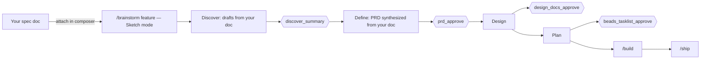

<!-- nav:top -->
[🏠 Onboarding](README.md) · [📚 Full Wiki](../wiki/README.md) · [🗺️ Visual journey](journey.html)

# 4 · Bringing your own spec

**Situation:** you already know exactly what one feature should be — you have a
PRD, a design doc, a ticket, or a written spec. You don't want pdlcflow to
*discover* the requirement from scratch; you want it to **build the thing you've
already specified**, while still getting the gates, tests, and artifacts.

This is the **document-driven** path. The trick is to feed your spec in as
grounding, run Inception in **Sketch** mode (where the agents draft from your
document and you just confirm), and move quickly through the gates.

## The idea in one picture

## Step by step

### 1. Have your spec as a document

Any text/markdown (or PDF/docx) spec works. If it isn't already a file, paste it
into one.

### 2. Attach it to the conversation

In the Studio composer, attach your spec file (the paperclip / drag-and-drop).
Attachments are stored as project artifacts and become **context the agents read
during Inception** — so the Discover/Define drafts are grounded in *your*
document, not invented.

### 3. Run `/brainstorm` in Sketch mode

Type `/brainstorm <feature name>` and choose **Sketch** mode (the composer has a
Sketch ⇄ Socratic toggle):

- **Sketch mode** = the agents pre-draft every answer from context (your spec),
  and you *edit/confirm* a whole round at once. This is exactly what you want
  when the answers already live in your document — you're reviewing, not
  authoring.
- **Socratic mode** = one open question at a time, answered from scratch. Right
  for greenfield discovery; slower when you already have a spec.

### 4. Move through the four Inception gates

Because the drafts come from your spec, each gate is a quick review-and-approve
rather than a from-scratch write:

| Gate | What you're approving | With a spec in hand |
|---|---|---|
| `discover_summary` | Problem, users, success metric, scope | Confirm it matches your spec |
| `prd_approve` | The synthesized PRD | Should mirror your spec; edit gaps, approve |
| `design_docs_approve` | Architecture, data model, API contracts, threat model, UX | Review the design the agents derive |
| `beads_tasklist_approve` | The decomposed `bd-NN` task list | Confirm the breakdown |

Approving each gate resumes the run to the next sub-phase.

### 5. Build and ship

Once Plan is approved, continue with the normal loop —
**[`/build → /ship`](6-implementing-a-requirement.md)**. Construction runs the
TDD loop against the tasks; Operation merges and deploys behind the ship gates.

## Power move: skip straight past discovery (API)

If your spec is authoritative and you want to bypass the early Inception rounds
entirely, the REST API's `POST /v1/commands` accepts a **`seed_state`** object.
You can pre-populate state — for example, start directly at `/build` with a
known task list, or seed a `prd_ref` so Define has nothing to ask. This is the
scripted, headless equivalent of "I already did discovery." See
[wiki · API Reference](../wiki/16-api-reference.md) for the request shape, and
[wiki · Inception](../wiki/08-inception.md) for what each sub-phase expects in
state.

> **Rule of thumb:** attach-and-Sketch for one feature you'll shepherd by hand;
> `seed_state` when you're automating or importing many pre-specified features.

## When *not* to use this path

- If you have a **whole roadmap** of features (not one spec), use
  **[5 · Bringing your own roadmap](5-bringing-your-own-roadmap.md)**.
- If you want the methodology to genuinely *pressure-test* a fuzzy idea
  (adversarial review, edge-case analysis, a progressive-thinking party), run
  full **Socratic** Inception instead — that's where Discover earns its keep.

---
<!-- nav:bottom -->
◀ [3 · Going deeper](3-going-deeper.md) · **Next → [5 · Bringing your own roadmap](5-bringing-your-own-roadmap.md)** · [🗺️ Visual journey](journey.html)
