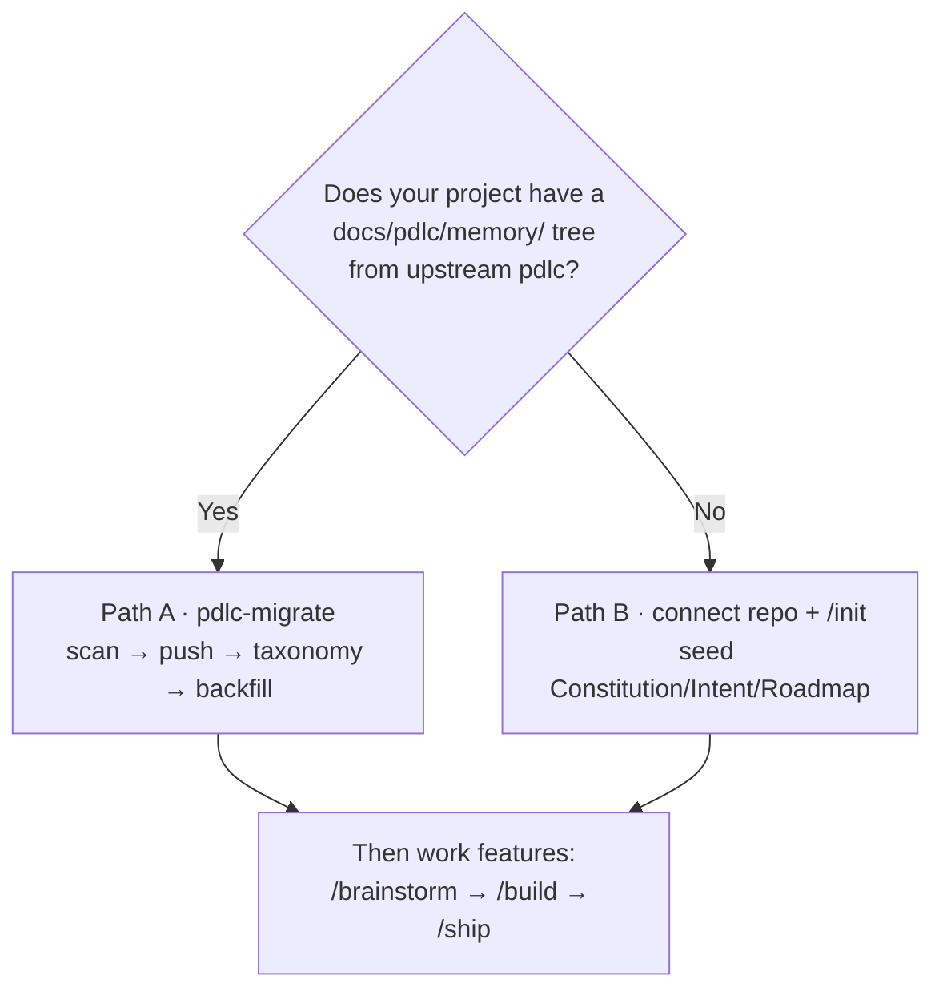

<!-- nav:top -->
[🏠 Onboarding](README.md) · [📚 Full Wiki](../wiki/README.md) · [🗺️ Visual journey](journey.html)

# 5 · Bringing your own roadmap

**Situation:** you have an **existing app** — code, history, and a roadmap or
backlog — and you want pdlcflow to adopt it without starting from a blank page.
Ideally the analytics dashboards aren't empty on day one, and your prior
decisions and deployments carry over.

There are two brownfield on-ramps. Pick by what you're bringing.

---

## Path A — You have an upstream `pdlc` project (file-based)

If your project already used the upstream `pdlc` methodology — a
`docs/pdlc/memory/` tree with STATE/DECISIONS/DEPLOYMENTS, `bd-NN` tasks,
episodes, and phase history — the **`pdlc-migrate`** CLI lifts all of it into a
pdlcflow tenant, and replays your history as events so the Nexus Console is
populated immediately.

### The four steps

`pdlc-migrate` runs a fixed pipeline: **`scan → push → taxonomy → backfill`**.
Point it at your project directory and your running engine.

```bash
# where to import into (from the Studio/API — the org and the target project)
export PDLC_ENGINE_URL=http://localhost:8000
export PDLC_ORG_ID=<your-org-uuid>
export PDLC_PROJECT_ID=<target-project-uuid>

# 1. Preview — counts only, no writes
pdlc-migrate scan     /path/to/your-pdlc-project

# 2. Import memory files + tasks + decisions + deployments
pdlc-migrate push     /path/to/your-pdlc-project \
  --engine-url "$PDLC_ENGINE_URL" --org-id "$PDLC_ORG_ID" --project-id "$PDLC_PROJECT_ID"

# 3. Tag the project's taxonomy (initiative / application / domains)
pdlc-migrate taxonomy /path/to/your-pdlc-project --engine-url "$PDLC_ENGINE_URL"

# 4. Replay phase history + decisions as a synthetic event stream
pdlc-migrate backfill /path/to/your-pdlc-project \
  --engine-url "$PDLC_ENGINE_URL" --org-id "$PDLC_ORG_ID" --project-id "$PDLC_PROJECT_ID"
```

> `pdlc-migrate` is the workspace CLI (`uv run pdlc-migrate …` from a source
> checkout, or the installed `pdlc-migrate` console script). It is **not** the
> database migrator — that's the one-time `alembic upgrade head` from setup.

### What each step lands

| Step | Imports | Becomes |
|---|---|---|
| **scan** | *(nothing — read-only preview)* | A manifest: memory files, episodes, `bd-NN` tasks, deployments, night-shift runs |
| **push** | memory files, tasks, decisions, deployments | Artifacts (`migrated/…`), durable tasks (each `bd-NN` `external_id` preserved), the `DECISIONS.md` registry, and `DEPLOYMENTS.md` history |
| **taxonomy** | initiative name, application name, domains | Those names are **upserted to real IDs** and stamped on every imported event — so the initiative & application rollups (not just domains) fill in |
| **backfill** | STATE.md phase history + DECISIONS.md | A stream of `synthetic: true` events (`phase.entered`, `deploy.succeeded`, `decision.recorded`, …) tagged with each feature's roadmap id |

### It's safe to re-run

Every synthetic event has a **deterministic id** and the analytics store dedups
on it. A second `push`/`backfill` against the same project adds **zero** new
events (the response reports `"events": 0`). So you can re-run the pipeline
freely — no duplicates.

### The payoff

The moment the pipeline finishes, the **Nexus Console** — the live feed, the
features timeline, and the roadmap/domain rollups — is **non-empty**. Your
history is there on day one. Full detail:
[wiki · Migrating an upstream project](../wiki/15-migration.md).

---

## Path B — You have any existing app (no upstream `pdlc` history)

If your app never used upstream `pdlc`, there's nothing to `migrate` — instead
you **connect the repo and seed the genesis**, then work features normally.

### 1. Connect the repository

In the Studio, **Repo** dropdown → **Connect repository** (name, the
`https://github.com/org/repo` URL, an access token stored encrypted). Or
`POST /v1/repositories`. Link it to a project via the project's `repository_id`.

Connecting the repo unlocks the repo-backed memory browser and — for single-user
self-host — the **real execution arc** (real tests / git merge / deploy against
your code; see [8 · Shipping & release](8-shipping-and-release.md)).

### 2. Seed your Constitution, Intent, and Roadmap with `/init`

Run **`/init <your product name>`** in the composer. The Initialization flow
walks three quick rounds:

1. **Product intent** — mission, target users, success metric.
2. **Constitution** — any standing rules beyond the PDLC defaults (TDD, the
   production-deploy ban, merge-commits-only), and your default interaction mode.
3. **Seed roadmap** — **paste your existing roadmap here**, one feature per line
   (with optional one-line rationales). Each becomes an `F-NNN` item.

It renders `CONSTITUTION.md`, `INTENT.md`, and `ROADMAP.md`, then pauses at the
`init_approve` gate. Approve, and you're in Inception.

### 3. Work the roadmap, feature by feature

For each roadmap item, run the day-two loop —
**[`/brainstorm → /build → /ship`](6-implementing-a-requirement.md)**. Your
Constitution and Intent are now the standing context every run honors.

---

## Which path am I on?



---
<!-- nav:bottom -->
◀ [4 · Bringing your own spec](4-bringing-your-own-spec.md) · **Next → [6 · Implementing a requirement](6-implementing-a-requirement.md)** · [🗺️ Visual journey](journey.html)
