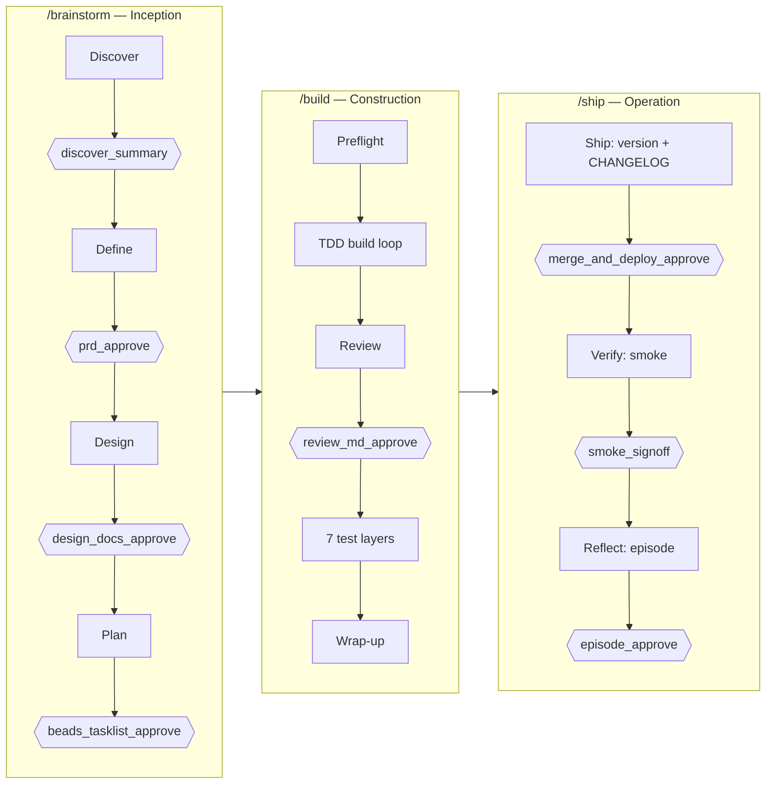

<!-- nav:top -->
[🏠 Onboarding](README.md) · [📚 Full Wiki](../wiki/README.md) · [🗺️ Visual journey](journey.html)

# 6 · Implementing a requirement

This is the everyday loop — turning one requirement into shipped, tested code.
Three commands, run in order, each pausing at gates for your approval:

**`/brainstorm` → `/build` → `/ship`**

You type them in the Studio composer (e.g. `/brainstorm dark mode`). Between
commands, and at each gate, the engine pauses and waits for you.



## Step 1 — `/brainstorm <feature>` (Inception)

Turns an idea into an approved, decomposed plan across four sub-phases. Each ends
in a gate — approving resumes to the next.

| Sub-phase | What happens | Gate | Artifact produced |
|---|---|---|---|
| **Discover** | Socratic (or Sketch) rounds, adversarial review, edge-case analysis, a progressive-thinking party | `discover_summary` | `discovery_summary_*.md` |
| **Define** | The PRD is synthesized from the discovery record | `prd_approve` | `PRD_*.md` |
| **Design** | Architecture, data model, API contracts, threat model, UX review | `design_docs_approve` | 5 design docs |
| **Plan** | The feature is decomposed into `bd-NN` tasks with a dependency/wave tree | `beads_tasklist_approve` | `plan_*.md` (the task list) |

**Interaction mode matters here.** Toggle **Sketch** (agents pre-draft, you
edit) vs **Socratic** (one question at a time). Sketch is fast when you know the
answers; Socratic is where the methodology pressure-tests a fuzzy idea. Already
have a written spec? See [4 · Bringing your own spec](4-bringing-your-own-spec.md).

## Step 2 — `/build` (Construction)

Implements the approved plan under test-first discipline.

- **Preflight** checks the plan is ready.
- The **TDD build loop** works each `bd-NN` task red → green → refactor. If a
  task fails three times, a **3-Strike → Strike Panel** convenes to unblock it.
- A **Review party** produces `REVIEW.md` (architecture / tests / security /
  docs), gated by **`review_md_approve`** — the single Construction gate.
- The **7 test layers** run, then **wrap-up**.

You approve one gate here (`review_md_approve`). Detail:
[wiki · Construction](../wiki/09-construction.md).

## Step 3 — `/ship` (Operation)

Merges, deploys, verifies, and reflects.

| Sub-phase | What happens | Gate |
|---|---|---|
| **Ship** | Computes the next semver, drafts the CHANGELOG, picks the deploy target (**production is filtered out** — defaults to `staging`), merges to main, deploys | `merge_and_deploy_approve` |
| **Verify** | Runs smoke checks against the deployed environment (`http_health`, `user_journey`) + a security sweep | `smoke_signoff` |
| **Reflect** | Writes the retrospective **episode** + metrics; on approval, **releases the roadmap claim** so the feature is done | `episode_approve` |

How deploy actually behaves — with or without your own release infra — is
covered in **[8 · Shipping & release](8-shipping-and-release.md)**.

## The gates, in one glance

Across the loop you approve **eight** gates (the ninth, `init_approve`, belongs
to `/init`, not this loop):

```
discover_summary · prd_approve · design_docs_approve · beads_tasklist_approve   ← /brainstorm
review_md_approve                                                                ← /build
merge_and_deploy_approve · smoke_signoff · episode_approve                       ← /ship
```

At every gate you can **approve**, **reject**, or **edit** the drafted artifact.
Rejecting keeps you in place; editing amends the artifact before continuing.

## Want it hands-off? `/night-shift`

Once Inception has produced a task plan, **`/night-shift`** runs Build → Ship
**autonomously**. It pauses **once** — the human **Contract Party** gate — then
auto-resolves every downstream gate under a watchdog (the **Sentinel**), which
aborts on real problems (failed required smoke checks, a production-deploy
attempt, stagnation). Production deploys are refused outright. See
[wiki · Night-Shift](../wiki/11-night-shift.md).

## Pausing & picking back up

- **`/pause`** checkpoints the active feature; **`/resume`** picks it back up.
- **`/compact`** distills a long working log to reclaim context if a run gets big.
- **`/doctor`** gives a read-only health check of the current feature.
- **`/abandon`** stops a feature and releases its roadmap claim (artifacts kept).

More: [wiki · Utility Commands](../wiki/12-utilities.md) and
[9 · Operating effectively](9-operating-effectively.md).

---
<!-- nav:bottom -->
◀ [5 · Bringing your own roadmap](5-bringing-your-own-roadmap.md) · **Next → [7 · Fixing a bug](7-fixing-a-bug.md)** · [🗺️ Visual journey](journey.html)
