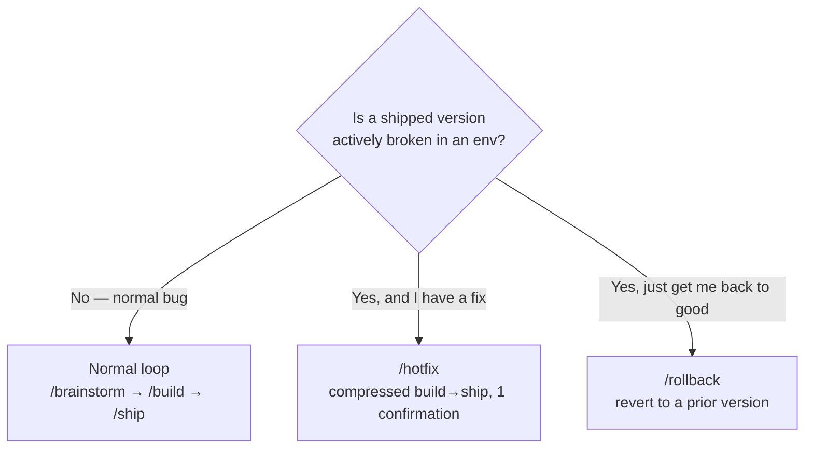

<!-- nav:top -->
[🏠 Onboarding](README.md) · [📚 Full Wiki](../wiki/README.md) · [🗺️ Visual journey](journey.html)

# 7 · Fixing a bug

Three tools, three situations. Pick by **urgency** and **whether you're fixing
forward or going back**.

## Normal loop — most bugs

A bug is just a small requirement. For anything that isn't an emergency, run the
ordinary **[`/brainstorm → /build → /ship`](6-implementing-a-requirement.md)**
loop scoped to the fix. You get the full treatment — a reproduction in Discover,
a test that fails first in Construction, review, and smoke verification — so the
bug is fixed *with* a regression test, not just patched.

Use it when: the bug isn't burning, and you want it fixed properly with tests
and gates.

## `/hotfix` — emergency, fix forward

**`/hotfix <what you're fixing>`** is a **compressed Build → Ship** for a
production issue that can't wait for the full loop. It **skips Inception and
Design** and pauses for exactly **one** human confirmation
(*"Confirm emergency hotfix deploy?"*), then merges and deploys and writes a
compact **`HOTFIX.md`** record.

- It's deliberately minimal — one gate, not eight — so you can move fast.
- The **production-deploy ban still applies**: a hotfix can't push to a
  production tier autonomously.
- Under `/night-shift` it auto-proceeds without the confirmation.

Use it when: something shipped is broken *now*, you have the fix, and the normal
multi-gate loop is too slow.

> A hotfix trades thoroughness for speed. Follow up with a normal-loop change
> that adds the regression test the emergency skipped.

## `/rollback` — go back to known-good

**`/rollback --to <version>`** reverts an **already-shipped** feature to a prior
version. It's the "undo" button: **pure and immediate — no gate, no
confirmation, no build**. It records a revert deploy (so the deployments view
reflects the rolled-back version) and writes a **`ROLLBACK.md`** note.

Use it when: a version you shipped is bad and the fastest safe move is to return
to the last good version — *then* diagnose at leisure.

## Side by side

| | Normal loop | `/hotfix` | `/rollback` |
|---|---|---|---|
| **Speed** | Full | Fast | Instant |
| **Human gates** | All 8 | 1 confirmation | None |
| **Builds code?** | Yes (TDD) | Yes (compressed) | No |
| **Adds a test?** | Yes | Not necessarily | No |
| **Direction** | Fix forward | Fix forward | Go back |
| **Best for** | Ordinary bugs | Burning prod issue | Bad ship, need good state now |
| **Prod-deploy ban** | Applies | Applies | n/a (re-points to prior) |

## A sensible incident flow

1. Production is broken → **`/rollback`** to the last good version to stop the
   bleeding.
2. Diagnose calmly.
3. Have the fix and it's still urgent → **`/hotfix`** it out.
4. Not urgent anymore → fold the proper fix + regression test into the
   **normal loop**.

Full reference: [wiki · Utility Commands](../wiki/12-utilities.md) and
[wiki · Operation](../wiki/10-operation.md).

---
<!-- nav:bottom -->
◀ [6 · Implementing a requirement](6-implementing-a-requirement.md) · **Next → [8 · Shipping & release](8-shipping-and-release.md)** · [🗺️ Visual journey](journey.html)
