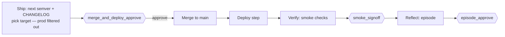

<!-- nav:top -->
[🏠 Onboarding](README.md) · [📚 Full Wiki](../wiki/README.md) · [🗺️ Visual journey](journey.html)

# 8 · Shipping & release

`/ship` always does the same **methodology** work — version bump, CHANGELOG,
merge, smoke verification, retrospective. What the **deploy** step actually *does*
depends on whether you've told pdlcflow how to deploy. And crucially: **if you
haven't, it won't pretend it did.**

## What `/ship` does regardless

1. Computes the next **semantic version** and drafts a **CHANGELOG** entry.
2. Picks a **deploy target** — with **production filtered out** (defaults to
   `staging`). More on why below.
3. Gate **`merge_and_deploy_approve`** — you approve version + CHANGELOG + target.
4. On approval: merges to main (merge-commit only), runs the **deploy step**,
   records the deploy, and writes `DEPLOYMENTS_*.md`.
5. **Verify** runs smoke checks against the deployed target → gate
   **`smoke_signoff`**.
6. **Reflect** writes the episode → gate **`episode_approve`**, then releases
   the roadmap claim.

The version, CHANGELOG, and DEPLOYMENTS records are produced **either way** —
they're methodology artifacts, not deploy side-effects.

## The deploy step: two worlds

### (a) You have release infra → wire it, get real deploys

pdlcflow doesn't reinvent your deploy — it **calls** it. On a single-user
self-host with the execution arc enabled, point it at your existing mechanism:

| Config | Meaning |
|---|---|
| `PDLC_DEPLOY_CMD` | A shell command with `{env}` / `{ref}` / `{feature}` substituted, run in the project's checked-out workspace. Print a line `deploy_url=https://…` (or just print the URL) and pdlcflow records it as the live environment URL. |
| `PDLC_DEPLOY_WEBHOOK` | Alternatively, pdlcflow POSTs `{env, ref, feature}` to your webhook and reads `url`/`id` from the JSON response. |

Examples of a `PDLC_DEPLOY_CMD`: a `helm upgrade …`, a `terraform apply …`, a
`gh workflow run deploy.yml …`, or your own `./deploy.sh {env} {ref}`. Whatever
URL it yields becomes the target that **Verify's smoke checks then hit** — so a
green `smoke_signoff` means your real environment answered.

> Real deploys run the deploy command **on the engine host**, so — like real
> test execution and stdio MCP — they're **single-user self-host only**: enabled
> by `PDLC_ENABLE_EXECUTION` and **refused when multi-tenant auth is on**. See
> [wiki · Configuration](../wiki/03-configuration.md).

### (b) You have no release infra → an honest simulation

Leave `PDLC_DEPLOY_CMD` / `PDLC_DEPLOY_WEBHOOK` unset (or run with execution
off). The deploy step becomes an **honest no-op**: the URL is a labeled
placeholder — `"(simulated — no deploy performed for <feature>)"` — **never a
fabricated URL**. You still get the full methodology: version, CHANGELOG, the
DEPLOYMENTS record (with version/sha/env), and the gates. Nothing lies about
having deployed.

This is the right default when you're evaluating pdlcflow, or when deploys still
happen through a separate system — you run the loop for the plan/artifacts, and
deploy out-of-band.

## The production-deploy ban (always on)

pdlcflow will not autonomously deploy to production. This is enforced in **three
independent layers**:

1. **Selection** — production-tier targets are filtered out of the candidate
   set, so `/ship` defaults to `staging`.
2. **Activation** — a production tier under the autonomous loop raises a
   `DeployBanError`.
3. **Sentinel** — the night-shift watchdog aborts on a `prod-deploy-attempted`
   marker.

Production requires a human at the keyboard, by design. Detail:
[wiki · Operation](../wiki/10-operation.md) → *the prod-deploy ban*.

## Two things called "release" that are **not** deploys

Don't confuse these with the ship/deploy step:

- **`/release`** (the slash command) — an **admin utility** that force-releases
  a **stuck roadmap claim** (sets it to unclaimed so the feature returns to the
  ready queue). It touches no git and no environment. Use it when a feature's
  claim is wedged. See [wiki · Utility Commands](../wiki/12-utilities.md).
- **`release-images.yml`** (CI) — the GitHub Actions workflow that builds and
  publishes the **pdlcflow platform's own container images** to GHCR when a
  `vX.Y.Z` tag is pushed. That's how *pdlcflow itself* is released for you to
  `docker compose pull`; it has nothing to do with deploying *your* app.

## Checklist: going from simulated to real deploys

1. Connect the project's git **repository** (see [5 · Bringing your own roadmap](5-bringing-your-own-roadmap.md)).
2. Confirm you're **single-user self-host** (auth not required).
3. Set `PDLC_ENABLE_EXECUTION=true`.
4. Set `PDLC_DEPLOY_CMD` **or** `PDLC_DEPLOY_WEBHOOK` to your deploy mechanism.
5. Run `/ship` — the smoke checks now hit the real URL your command returned.

For a full first-cloud deploy of the platform to AWS/GCP/Azure, see the
[Terraform deploy runbook](../../infra/terraform/DEPLOY_RUNBOOK.md).

---
<!-- nav:bottom -->
◀ [7 · Fixing a bug](7-fixing-a-bug.md) · **Next → [9 · Operating effectively](9-operating-effectively.md)** · [🗺️ Visual journey](journey.html)
