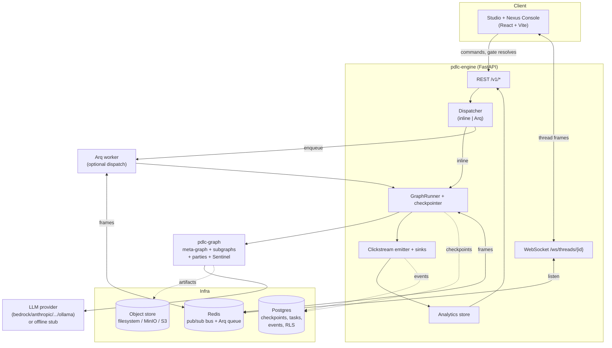

<!-- nav:top -->
[🏠 Wiki Home](README.md)

# Overview

pdlcflow is a stand-alone runtime for the **Product Development Lifecycle (PDLC)** methodology. Where the upstream `pdlc` plugin runs PDLC inside Claude Code on a single dev box, pdlcflow lifts the same workflow off the editor into a self-hostable (or SaaS) service: a Python **LangGraph engine** drives a feature through four phases — **Initialization, Inception, Construction, Operation** — pausing at **8 approval gates**, fanning work out to **10 agent personas** (and party meetings), enforcing TDD and a hard production-deploy ban, and emitting a **50+-event clickstream** that powers an admin analytics console. The whole thing is driven over a REST + WebSocket API by a React Studio UI.

On top of the workflow sits a full **per-tenant provider platform**: each org picks its own LLM provider and models (8 providers incl. a generic OpenAI-compatible gateway), brings its own API key (BYOK), and gets connectivity probes, a preset catalog, automatic failover with a circuit breaker, per-org rate limits, cost budgets, immutable config versioning, egress controls, org-tunable persona prompts, and optional **MCP tool servers** that give agents external tools — all org-scoped and RLS-isolated. See [Configuration](03-configuration.md) and [MCP Tool Servers](20-mcp-tools.md).

## The methodology in one paragraph

A feature flows through four phases. The **meta-graph** (`packages/pdlc-graph/pdlc_graph/graphs/meta.py`) routes by `state.phase` to a subgraph: `init`, `brainstorm` (Inception), `build` (Construction), `ship` (Operation), `night_shift` (when a night-shift run is active), or `utility` (for the standalone commands). **17 commands** (`init`, `brainstorm`, `build`, `ship`, `decide`, `whatif`, `doctor`, `rollback`, `hotfix`, `night-shift`, `pause`, `resume`, `abandon`, `release`, `override`, `pdlc`, `setup`) start or steer a run. Along the way the engine stops at **8 approval gates** in order — `discover_summary`, `prd_approve`, `design_docs_approve`, `beads_tasklist_approve` (Inception); `review_md_approve` (Construction); `merge_and_deploy_approve`, `smoke_signoff`, `episode_approve` (Operation) — each surfaced to the human over the API. Work is performed by 10 personas (always-on: Neo, Echo, Phantom, Jarvis; the rest auto-selected by task labels), with **party meetings** fanning out to multiple personas in parallel and rendering a minutes-of-meeting decision. `/night-shift` collapses every gate to auto-approval behind a single human "contract" gate so a feature can run autonomously from Build through Ship, watched by a deterministic Sentinel.

## Component inventory

| Component | Path | Role |
|-----------|------|------|
| **event-schema** | `packages/event-schema/` | `EventEnvelope` + the 50+-event taxonomy (registry in `event_schema/registry.md`). Carries tenancy + traceability dims on every event. |
| **pdlc-graph** | `packages/pdlc-graph/` | The LangGraph engine: meta-graph router + `meta/brainstorm/build/ship/night_shift/utility` subgraphs, party orchestrator, 10 persona soul-specs, the 8 gates, the deterministic Sentinel evaluator, and dep-free injectable ports (LLM, tracing, prompt-resolver, tool/MCP). |
| **pdlc-engine** | `services/pdlc-engine/` | FastAPI service: REST (`/v1/...`) + WebSocket (`/ws/...`), runtime (GraphRunner + checkpointer + dispatcher + event bus), analytics rollups, clickstream emitter, persistence adapters, the 8-provider LLM factory (BYOK, failover, circuit breaker, presets), the MCP tool backend, OpenTelemetry wiring, Alembic migrations. |
| **studio** | `apps/studio/` | React + Vite + Tailwind UI — the Studio chat/feature view **and** the Nexus Console admin dashboard in one bundle. |
| **Postgres** | compose `postgres:17` | Durable graph checkpoints, the task store, analytics events, and row-level-security tenancy. |
| **Redis** | compose `redis:7` | Pub/sub event bus (cross-process WebSocket fan-out + live night-shift verdicts) and the Arq job queue. |
| **Object store** | compose `minio` (S3-compatible) | Artifact store (PRD/design/review docs, memory bodies). Self-host default is the filesystem volume; MinIO/S3 is optional. |
| **Analytics** | `services/pdlc-engine/app/analytics/` | Rollups by dimension (initiative/application/squad/domain/roadmap/user_story/agent) with events + tokens + USD, served to the Nexus Console. |
| **pdlc-migrate** | `tools/pdlc-migrate/` | `scan`/`push`/`taxonomy`/`backfill` CLI to import an upstream `pdlc` project and seed the dashboards. |

## System architecture

## Self-host vs SaaS

pdlcflow ships two deployment tracks:

- **Self-host (single-tenant)** — `infra/compose/docker-compose.yml`. One `docker compose up` brings up Postgres, Redis, MinIO, the API, the Arq worker, and Studio (with an optional Caddy auto-TLS profile). This is the path documented in these pages. Auth is open (JWT scaffolded, enforcement deferred); artifacts default to a mounted filesystem volume; analytics + checkpoints + tasks live in the bundled Postgres.
- **SaaS (multi-tenant)** — `infra/cdk/`, an AWS CDK app (network/data/compute/edge/auth/events/bedrock/observability stacks) targeting Bedrock, Cognito/SSO, per-tenant KMS, Firehose→S3 telemetry, and forced row-level-security. The same engine code runs in both; the difference is which flag-gated backends are wired (see the configuration page).

A key design property: **every backend defaults to in-memory and falls back to in-memory if its infrastructure is unreachable**, so the engine always boots — even with no Postgres, Redis, or object store present. That makes dev and the hermetic test suite infra-free, and makes the production adapters opt-in via `PDLC_` flags.

---

---
<!-- nav:bottom -->
⏮ [First: Overview](01-overview.md) · ◀ [Prev: Home](README.md) · [🏠 Home](README.md) · [Next: Installation](02-installation.md) ▶ · [Last: Evals Framework](17-evals.md) ⏭
