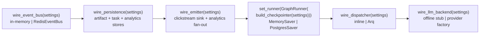

<!-- nav:top -->
[🏠 Wiki Home](README.md)

# Launching & Operating

This page covers bringing the stack up (Compose and dev mode), the health probes, the boot/wiring order, and how to confirm each backend actually engaged.

## Bring the stack up (Compose)

From `infra/compose/` (after `cp .env.example .env` and editing secrets):

```bash
docker compose up --build
```

This starts `postgres`, `redis`, `minio`, `api` (8000), `worker` (Arq), and `studio` (8080). Postgres and Redis come up behind healthchecks; `api` and `worker` wait for them. Apply migrations once:

```bash
docker compose exec api uv run alembic upgrade head
```

Optional auto-TLS reverse proxy (edit `caddy/Caddyfile` for your hostname first):

```bash
docker compose --profile tls up
```

The `worker` runs `uv run arq app.worker.arq_settings.WorkerSettings`. It only does real work when `PDLC_USE_ARQ_DISPATCH=true`; otherwise the API runs graph turns inline and the worker idles. For cross-process resume the worker must share state with the API, which requires `PDLC_USE_POSTGRES_CHECKPOINTER=true` (each `MemorySaver` is process-local).

## Dev mode (no Docker)

Two processes, defaults all in-memory:

```bash
# Engine
uv run uvicorn app.main:app --reload --app-dir services/pdlc-engine --port 8000

# Studio (separate shell)
pnpm --filter @pdlcflow/studio dev      # Vite :5173, proxies /v1 + /ws to :8000
```

## Health checks

The engine exposes two unauthenticated probes (`services/pdlc-engine/app/routes/health.py`):

```bash
curl http://localhost:8000/health
# {"status":"ok","phase":"A"}

curl http://localhost:8000/health/ready
# {"status":"ready","checks":{"db":"stub","redis":"stub","llm":"stub"}}
```

> `/health` is liveness — use it for the load-balancer / smoke check. `/health/ready` currently returns stubbed dependency checks (it does not yet probe DB/Redis/LLM connectivity), so do not treat its `checks` values as proof a backend is live.

## Boot / wiring order

The FastAPI lifespan (`app/main.py`) wires the seams in a deliberate order, and the Arq worker (`app/worker/arq_settings.py`) repeats the same sequence on its `startup` so both processes share the configuration:



Why this order:

1. **`wire_event_bus`** first — the emitter fans night-shift frames out through the bus, so the bus must exist before the emitter.
2. **`wire_persistence`** before the emitter (so the emitter grabs the configured analytics store) and before any graph turn (so the artifact/task ports point at real backends).
3. **`wire_emitter`** — installs the clickstream sink with a second fan-out into the analytics read store.
4. **`set_runner` + `build_checkpointer`** — one `GraphRunner` owns the checkpointer that makes `interrupt()` sites resumable across turns.
5. **`wire_dispatcher`** — selects inline vs Arq dispatch for `/v1/commands` and gate resolves.
6. **`wire_llm_backend`** — routes persona completions through the provider factory only when `PDLC_WIRE_LLM` is set; otherwise the offline stub stays.

## Confirming each backend is active

Because every seam silently falls back to in-memory, confirm the real path engaged via the startup logs and behavior:

```bash
docker compose logs -f api worker
```

| Backend | Look for | Falls back to |
|---------|----------|---------------|
| Postgres checkpointer | `PostgresSaver checkpointer active (durable, multi-process)` | `MemorySaver` (logs `PostgresSaver unavailable (...)`) |
| Artifact store | `artifact store: filesystem (...)` or `artifact store: s3 (...)` | in-memory |
| Task store | `task store: postgres` | in-memory |
| Analytics backend | `analytics backend: postgres` | in-memory |
| Redis bus | no fallback warning; cross-process WS frames arrive | in-memory bus |
| LLM | provider calls only when `PDLC_WIRE_LLM=true` | offline deterministic stub |

End-to-end smoke after boot + migrations:

```bash
# Start a command (offline stub is fine)
curl -s -X POST http://localhost:8000/v1/commands \
  -H 'content-type: application/json' \
  -d '{"command":"brainstorm","org_id":"org-1","project_id":"proj-1","feature":"demo"}'
# -> {"thread_id":"...","started":true,"pending":{...}}

# List the open approval gate for that project
curl -s "http://localhost:8000/v1/approval-gates?org_id=org-1&project_id=proj-1"
```

To confirm the **WebSocket** stream, connect to `ws://localhost:8000/ws/threads/{thread_id}` (or via Studio) — you should receive `hello`, then `interaction.opened` / `thread.completed` frames (and `night_shift.*` frames during a night-shift run). To confirm **analytics** wiring, hit an admin rollup with an org scope (omitting `org_id` returns 403 with an `admin.access.denied` audit event):

```bash
curl -s "http://localhost:8000/v1/admin/live?org_id=org-1"
```


---
<!-- nav:bottom -->
⏮ [First: Overview](01-overview.md) · ◀ [Prev: Configuration](03-configuration.md) · [🏠 Home](README.md) · [Next: Core PDLC Flow](05-core-flow.md) ▶ · [Last: API Reference](16-api-reference.md) ⏭
