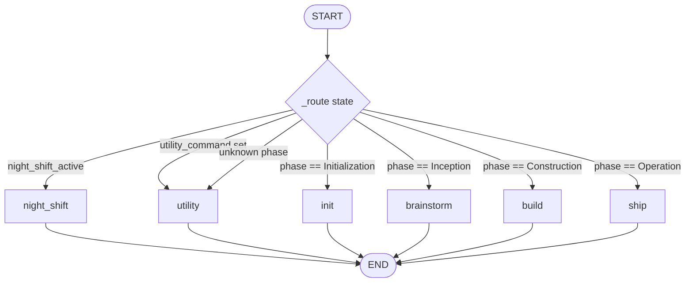
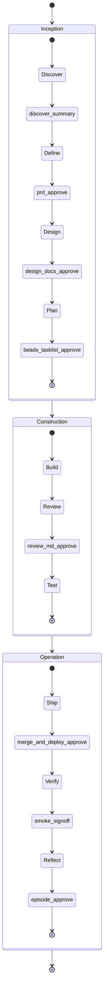

<!-- nav:top -->
[🏠 Wiki Home](README.md)

# Core PDLC Flow

pdlcflow runs every feature through one deterministic state machine: a **meta-graph**
that routes to a phase subgraph based on `state.phase` (and a few override flags). The
methodology is four phases — **Initialization → Inception → Construction → Operation** —
punctuated by **8 human approval gates**. This page is the map: how routing works, what
each phase does, and exactly what a human approves at each gate.

## The four phases

| Phase | Subgraph | What happens | Gates owned |
|---|---|---|---|
| **Initialization** | `init` | One-time project setup (CONSTITUTION, memory scaffold). | — |
| **Inception** | `brainstorm` | Discover → Define → Design → Plan: turn an idea into an approved, decomposed task plan. | discover_summary, prd_approve, design_docs_approve, beads_tasklist_approve |
| **Construction** | `build` | Preflight → wave/TDD build loop → review → 7 test layers. | review_md_approve |
| **Operation** | `ship` | Ship (merge + deploy) → Verify (smoke) → Reflect (episode). | merge_and_deploy_approve, smoke_signoff, episode_approve |

The phase a feature rests in is the single source of truth. Commands (`/brainstorm`,
`/build`, `/ship`) set the phase; the meta-graph dispatches accordingly.

## Meta-graph routing

The router lives in `packages/pdlc-graph/pdlc_graph/graphs/meta.py`. It consults two
override flags first, then falls back to the phase map:

1. `state.night_shift_active` → `night_shift` (the autonomous loop wraps build + ship).
2. `state.utility_command` set (e.g. `/decide`, `/doctor`, `/pause`) → `utility`,
   regardless of resting phase.
3. Otherwise the `phase` field maps to its subgraph; an unknown phase falls through to
   `utility`.

`build_meta_graph(checkpointer=None)` compiles the graph. The checkpointer (MemorySaver
in tests/dev, PostgresSaver when `PDLC_USE_POSTGRES_CHECKPOINTER` is set) is what makes
the `interrupt()` sites inside the nested subgraphs resumable across HTTP turns. Without
one the graph runs straight through (used only for routing tests).

Each phase subgraph is itself a composed chain of sub-phase subgraphs. The inner graphs
are compiled **without** their own checkpointer so their `interrupt()` calls bubble up to
the top-level checkpointer — that is how a gate deep inside, say, Design pauses the whole
run and resumes cleanly.

## The 8 approval gates

Every gate is an `interrupt()` site created by `gates.approval_gate(state, gate_kind,
payload)` (`packages/pdlc-graph/pdlc_graph/gates.py`). The engine turns each interrupt
into an `<ApprovalGateModal>` over the WebSocket; the human's verdict
(`{approved, comment?, edit?}`) resumes the graph via `POST
/v1/approval-gates/{id}/resolve`.

The canonical order (`GATE_KINDS`):

| # | Gate kind | Phase | Subgraph node | What the human approves |
|---|---|---|---|---|
| 1 | `discover_summary` | Inception | `discover` → `discover_gate` | The synthesized discovery summary (problem, user, success metric, scope, risks) before any PRD is written. |
| 2 | `prd_approve` | Inception | `define` → `prd_gate` | The drafted PRD (requirements, user stories, acceptance criteria). |
| 3 | `design_docs_approve` | Inception | `design` → `design_gate` | The 5-artifact design package: ARCHITECTURE, data-model, api-contracts, threat-model, ux-review. |
| 4 | `beads_tasklist_approve` | Inception | `plan` → `plan_gate` | The decomposed task list + dependency/wave tree (rendered as a Mermaid companion). |
| 5 | `review_md_approve` | Construction | `build` → `review_gate` | The as-built REVIEW.md from the Party Review (architecture/tests/security/docs). |
| 6 | `merge_and_deploy_approve` | Operation | `ship` → `merge_deploy_gate` | The version bump, CHANGELOG, and the chosen deploy target — before merge to main + deploy. |
| 7 | `smoke_signoff` | Operation | `verify` → `smoke_gate` | The post-deploy security sweep + smoke results against the live environment. |
| 8 | `episode_approve` | Operation | `reflect` → `episode_gate` | The retrospective episode file, before it is committed and the roadmap claim is released. |

### Gate verdict shape

`approval_gate` returns `{"approved": bool, "comment": str|None, "edit": dict|None,
"auto"?: bool}`. A bare boolean resume is coerced to `{"approved": bool}`. An unknown
`gate_kind` raises `ValueError`.

### Night-shift auto-decision

Under `state.night_shift_active`, gates do **not** block. `approval_gate` calls
`_auto_decision`, which approves unless the payload carries a `blocking` field (a hard
blocker — e.g. a critical review finding or a failed required smoke check), in which case
it refuses and records why. This is how the autonomous loop walks all 8 gates with no
human turn while still bailing out on real problems. (The night-shift Contract Party is a
separate, raw `interrupt()` — the one human gate — and is *not* one of these 8.)

## A feature through the gates

At each gate the run pauses; the human approves (or rejects/edits) in Studio; the engine
resumes the graph. Gates 1–4 belong to Inception, gate 5 to Construction, gates 6–8 to
Operation. Between phases the subgraph writes a `handoff` patch (`phase_completed`,
`next_phase`, `key_outputs`, `next_action`) so the next command picks up exactly where the
last left off.

## Interaction modes

Inside a phase, the agents ask the human questions through `interaction.ask`. Two cadences
cover identical depth (set in CONSTITUTION §8, read from `state.interaction_mode`):

- **Sketch** (default) — the agent drafts answers from context and batches a whole round;
  the human edits. The drafts ride the interrupt payload.
- **Socratic** — one open question at a time, answered from scratch.

Approval gates (the 8 above) are distinct from question rounds: gates approve an artifact;
`ask` collects answers. Both are `interrupt()` sites and both auto-resolve under
night-shift (Sketch drafts are auto-accepted).

---

---
<!-- nav:bottom -->
⏮ [First: Overview](01-overview.md) · ◀ [Prev: Launching & Operating](04-launching.md) · [🏠 Home](README.md) · [Next: Agents](06-agents.md) ▶ · [Last: Evals Framework](17-evals.md) ⏭
