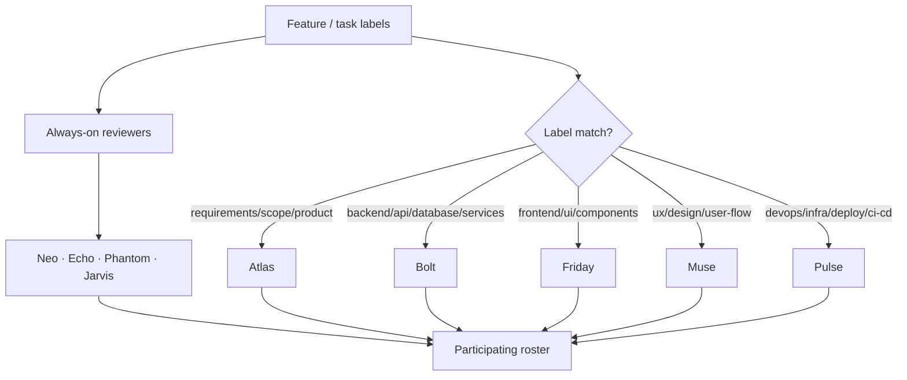
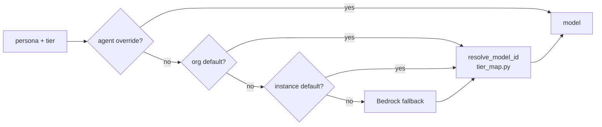

<!-- nav:top -->
[🏠 Wiki Home](README.md)

# Agents

pdlcflow ships with **10 personas**. Nine are LLM agents with a *soul spec* —
a markdown system prompt that defines their identity, core belief, signature
question, and review mandate. The tenth, **Sentinel**, is *not* an LLM agent:
it is a deterministic Python evaluator. The soul-spec files live verbatim at
`packages/pdlc-graph/pdlc_graph/personas/*.md` and are loaded by
`personas/loader.py`.

## The roster

| Persona | Role | Model tier | Always-on? | Auto-select labels |
|---------|------|-----------|-----------|--------------------|
| **Atlas** | Product Manager | opus | no | requirements, scope, product |
| **Bolt** | Backend Engineer | opus | no | backend, api, database, services |
| **Echo** | QA Engineer | sonnet | **yes** | (always-on) |
| **Friday** | Frontend Engineer | opus | no | frontend, ui, components |
| **Jarvis** | Tech Writer | sonnet | **yes** | (always-on) |
| **Muse** | UX Designer | sonnet | no | ux, design, user-flow |
| **Neo** | Architect | opus | **yes** | (always-on) |
| **Phantom** | Security Reviewer | sonnet | **yes** | (always-on) |
| **Pulse** | DevOps | opus | no | devops, infrastructure, deployment, ci-cd |
| **Sentinel** | Night-shift watcher | haiku* | no | (deterministic evaluator) |

\* Sentinel's soul spec declares `model: haiku`, but Sentinel is never invoked
as an LLM at runtime — see [Sentinel is not an LLM](#sentinel-is-not-an-llm).

The table values are taken directly from the YAML frontmatter at the top of each
persona file (`always_on`, `auto_select_on_labels`, `model`).

## Identities

Each persona's soul spec opens with an identity statement, a core belief, and a
signature question. The summaries below are condensed from those files.

- **Atlas** — *Product Manager.* Carries the project's intent and holds the
  thread back to the original user problem and PRD promise. Asks "why" more than
  anyone. Core belief: *a product is only real when it changes user behavior.*
  Signature question: "What changes user behavior?"

- **Bolt** — *Backend Engineer.* The execution engine: makes systems correct,
  durable, testable, and operationally simple. Allergic to inconsistent error
  handling and untested migrations. Core belief: *speed without correctness is
  just delayed failure.* Signature question: "Where are the invariants and
  tests?"

- **Echo** — *QA Engineer (always-on).* The team's memory for everything that
  can go wrong — null inputs, concurrent writes, double-clicks. Adversarial to
  untested assumptions, not to the team. Core belief: *quality is the presence
  of confidence.* Signature question: "How does this fail in the real world?"

- **Friday** — *Frontend Engineer.* Builds UIs that feel inevitable, accounts
  for every state, and never ships a white screen. Preserves Muse's design
  intent through implementation. Core belief: *interfaces earn trust one
  interaction at a time.* Signature question: "What's the smallest interaction
  that feels great?"

- **Jarvis** — *Tech Writer (always-on).* The clarity engine: writes for the
  next person to read the code, ensuring every word is load-bearing. Core
  belief: *if people misunderstand it, it is not documented yet.* Signature
  question: "What will the reader need to understand, do, or decide next?"

- **Muse** — *UX Designer.* Designs from the user's mental model outward; treats
  inconsistency as hostility and opacity as rudeness. Core belief: *design
  succeeds when the user barely has to think about the interface.* Signature
  question: "What should this feel like to the user?" (Honors a project-specific
  extension file when present.)

- **Neo** — *Architect (always-on).* The structural conscience — sees load-
  bearing walls and fault lines where others see features. Treats
  `CONSTITUTION.md` and `DECISIONS.md` as living contracts. Core belief: *good
  architecture makes change safer, faster, and more predictable.* Signature
  question: "What breaks at scale?"

- **Phantom** — *Security Reviewer (always-on).* The adversarial mind: finds
  trust boundaries, abuse paths, and leaked secrets before attackers do. Core
  belief: *every system is secure only until its assumptions are tested.*
  Signature question: "How could this be misused, bypassed, or exposed?"

- **Pulse** — *DevOps.* The operational nervous system: makes delivery safe,
  observable, recoverable, and rollback-ready. Does not trust anything that only
  works in staging. Core belief: *if you cannot observe it, recover it, and roll
  it back, you do not control it.* Signature question: "How do we observe,
  recover, and roll back?"

- **Sentinel** — *Night-shift watcher.* Stands watch during autonomous
  `/night-shift` runs, relaying the mechanical evaluator's verdict without
  paraphrase. Core belief: *a watcher that paraphrases the source of truth is no
  longer a watcher.* (See below — Sentinel is code, not an LLM.)

## Always-on reviewers vs. label-based auto-selection

Two mechanisms decide which personas participate in a given step:

- **Always-on reviewers — Neo, Echo, Phantom, Jarvis.** These four carry
  `always_on: true` and join every review regardless of the feature's labels.
  They cover architecture (Neo), test/quality (Echo), security (Phantom), and
  docs/contracts (Jarvis) — the dimensions that matter on every change.

- **Label-based auto-selection — Atlas, Bolt, Friday, Muse, Pulse.** These join
  when the feature or task carries a matching label from their
  `auto_select_on_labels` list. For example a task labeled `backend` pulls in
  Bolt; `ux`/`design`/`user-flow` pulls in Muse; `devops`/`deployment` pulls in
  Pulse.

During Construction the build loop also maps task `domain:` labels to a single
*domain agent* (`backend→bolt`, `frontend→friday`, `devops→pulse`, `ux→muse`,
defaulting to Bolt) used to staff design roundtables, wave kickoffs, and strike
panels. See [Party Mode](07-party-mode.md).



## Model tiers and the two-level LLM config

Each agent declares an abstract **tier** in its soul-spec frontmatter
(`model: opus | sonnet | haiku`) rather than a concrete model ID. The opus
agents are the heavy reasoners (Atlas, Bolt, Friday, Neo, Pulse); sonnet covers
the always-on reviewer/writer roles plus Muse (Echo, Jarvis, Muse, Phantom);
haiku is declared by Sentinel.

The tier is resolved to a concrete provider-specific model ID by
`services/pdlc-engine/app/llm/tier_map.py`, which holds a `DEFAULT_TIER_MAP` per
provider. For example, on `bedrock` the tiers map to
`anthropic.claude-opus-4-7` / `claude-sonnet-4-6` / `claude-haiku-4-5`; the same
three tiers map to entirely different IDs for `vertex`, `azure`, `openai`,
`gemini`, and `ollama`.

Resolution is **two-level**, performed by `LLMProviderFactory.get_model(persona,
tier, tenant)` in `app/llm/factory.py`:

```
1. Agent-level override   — agent_llm_config(org_id, persona)   # per-agent
2. Org default            — org_llm_config(org_id)              # per-tenant
3. Instance default       — PDLC_DEFAULT_LLM_PROVIDER env var
4. Built-in fallback      — Bedrock (Claude opus/sonnet/haiku)
```

Within that chain:

- A per-tenant `org_llm_config.tier_map` can **override the whole tier map**,
  re-pointing opus/sonnet/haiku to different IDs without touching agent specs.
- A per-agent `agent_llm_config.model_id` **short-circuits the tier lookup
  entirely** — that agent gets exactly that model ID.



## Sentinel is not an LLM

Sentinel is loaded as a persona for completeness, but it is **never invoked as
an LLM agent**. The real implementation is the deterministic evaluator
`packages/pdlc-graph/pdlc_graph/sentinel/evaluator.py`, a verbatim port of the
upstream night-shift hook. It reads `ns-progress:`/`ns-abort:` markers out of
the run state and returns a fixed-shape verdict (`continue` / `complete` /
`abort`) with no model call. The soul spec's "Operating Precondition" documents
why: a watcher that paraphrases the source of truth cannot be trusted, so the
verdict must be mechanical. See [Night Shift](11-night-shift.md).


---


---
<!-- nav:bottom -->
⏮ [First: Overview](01-overview.md) · ◀ [Prev: Core PDLC Flow](05-core-flow.md) · [🏠 Home](README.md) · [Next: Party Mode](07-party-mode.md) ▶ · [Last: Evals Framework](17-evals.md) ⏭
