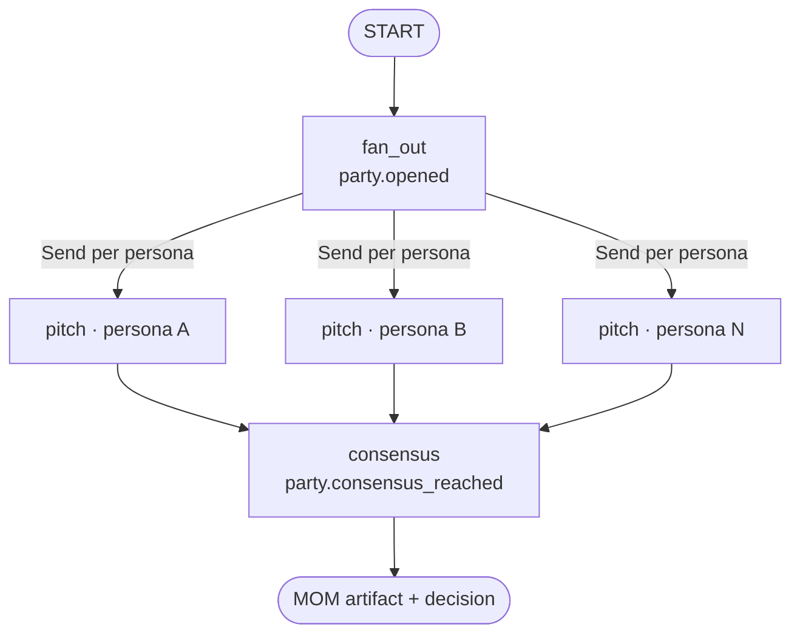

<!-- nav:top -->
[🏠 Wiki Home](README.md)

# Party Mode

Party Mode is how multiple personas deliberate together. One orchestrator
pattern serves **every** party kind:
`packages/pdlc-graph/pdlc_graph/graphs/parties/orchestrator.py`. A party fans
out to N personas in parallel, collects a *pitch* from each, then a consensus
node renders a **MOM** (minutes-of-meeting) artifact and produces a binding
decision.

## The orchestrator pattern

The party is a small LangGraph subgraph with three nodes: `fan_out`, `pitch`,
and `consensus`.

1. **fan_out** initializes the additive `pitches` accumulator, then a
   `_dispatch` edge emits one LangGraph `Send("pitch", …)` per persona in the
   roster — the pitches run in parallel.
2. **pitch** (one instance per persona) builds a prompt from the party kind,
   topic, and context and calls `llm_port.complete(persona, prompt)`, appending
   `{persona, pitch}` to the accumulator.
3. **consensus** renders the MOM via `render_mom(...)`, persists it with
   `put_artifact(...)`, and returns `{mom_ref, decision, auto}`.



Each step emits a telemetry event (`party.opened`, `party.pitch_received`,
`party.consensus_reached`). The public entry point is:

```python
run_party(
    *, feature, project_id, kind, topic, roster, context="",
    night_shift_active=False,
) -> {"mom_ref", "decision", "pitches", "auto"}
```

Sub-phase nodes call `run_party(...)` directly as a normal function call, and
stash the result under `state["party_results"][<kind>]`.

### Night-shift behavior

When `night_shift_active=True`, the consensus node **auto-picks** the
synthesized consensus and tags the MOM instead of pausing for human
ratification. The returned `auto` flag is `True` in that case. (Where a party
feeds a human choice — e.g. the Strike Panel A/B/C prompt — the caller, not the
orchestrator, auto-selects the recommended option under night-shift.)

## Triage: skip / lite / full

Before a *Design-phase* party is ever convened, a 3-signal checklist decides
whether to hold it at all. `triage_level(signals)` counts the `True` signals:

| Yes count | Level | Meaning |
|-----------|-------|---------|
| 0 | `skip` | No party — proceed directly |
| 1 | `lite` | Lead handles it solo (roster of one) |
| 2–3 | `full` | Full party (lead + supporting roster) |

In Design, `threat-model` and `design-laws` both run this gate: on `lite` the
roster is just the lead (`["phantom"]` or `["muse"]`); on `full` the lead is
joined by supporting reviewers. Construction's `design-roundtable` uses its own
per-task auto-trigger (multi-domain labels or `needs_design`) rather than the
3-signal gate.

## Party kinds

| Kind | Phase / sub-phase | Trigger | Lead | Roster | Output |
|------|-------------------|---------|------|--------|--------|
| `progressive-thinking` | Inception / Discover | **Always** | Atlas | Atlas + 8 (atlas, neo, echo, phantom, bolt, friday, …) | MOM; refines Discover findings into `party_results["progressive-thinking"]` |
| `threat-model` | Inception / Design | Triage `lite`/`full` | Phantom | lite: `[phantom]`; full: `[phantom, neo, bolt, atlas]` | MOM + `threat-model.md` (`threat_model_ref`) |
| `design-laws` | Inception / Design | Triage `lite`/`full` | Muse | lite: `[muse]`; full: `[muse, neo, echo, phantom]` | MOM + `ux-review.md` design-laws findings |
| `wave-kickoff` | Construction | Per wave with **≥2 tasks** | Neo | `[neo, *domain agents of the wave]` | MOM standup; surfaces hidden deps + ordering |
| `design-roundtable` | Construction | Per-task auto-trigger (multi-domain / needs_design) | Neo | `[neo, echo, <domain agent>]` | MOM; agreed implementation approach |
| `party-review` | Construction / Review | Always (replaces sequential review) | Neo | `[neo, echo, phantom, jarvis]` (+`muse` if UX) | MOM + `REVIEW_*.md` (`review_ref`) |
| `strike-panel` | Construction / build loop | On the **3rd** failed test attempt | Neo | `[neo, echo, <domain agent>]` | MOM + 3 ranked approaches (A/B/C) |

Notes on the roster mechanics, drawn from the call sites:

- **progressive-thinking** (`brainstorm/discover.py`) uses the
  `PROGRESSIVE_ROSTER` constant and runs unconditionally during Discover.
- **threat-model / design-laws** (`brainstorm/design.py`) compute `signals`,
  call `triage_level`, and only convene a party on `lite`/`full`; on `skip` no
  party runs and the artifact records the triage outcome.
- **wave-kickoff / design-roundtable** (`build/loop.py`) staff their roster from
  the per-task **domain agent** map (`backend→bolt`, `frontend→friday`,
  `devops→pulse`, `ux→muse`, default `bolt`). Wave kickoff only fires when a
  wave has ≥2 tasks (nothing to coordinate otherwise).
- **party-review** (`build/review.py`) always includes the four always-on
  reviewers `[neo, echo, phantom, jarvis]`, and appends `muse` when a UX review
  exists (`ux_review_ref`). Neo synthesizes across all reviewers.
- **strike-panel** (`build/loop.py`) fires on the 3rd failed test attempt — not
  on attempts 1–2, which are normal TDD iteration — and produces three ranked
  approaches; under night-shift the recommended approach (index 0) is
  auto-picked, otherwise the loop `interrupt()`s for a human A/B/C choice.

## Output: the MOM artifact

Every party persists a minutes-of-meeting markdown artifact via `put_artifact`
under `mom/<feature>_<kind>.md`, returning its URI as `mom_ref`. The MOM records
the participants, each persona's pitch, the decision, and next steps, and is
referenced from the downstream design/review artifact so the deliberation is
auditable.


---


---
<!-- nav:bottom -->
⏮ [First: Overview](01-overview.md) · ◀ [Prev: Agents](06-agents.md) · [🏠 Home](README.md) · [Next: Inception (the brainstorm subgraph)](08-inception.md) ▶ · [Last: Evals Framework](17-evals.md) ⏭
