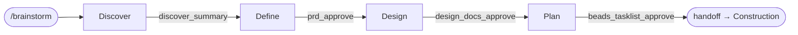
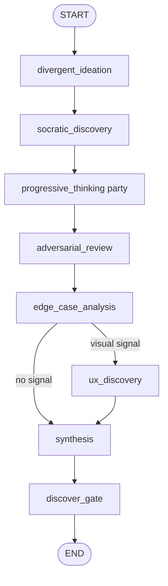
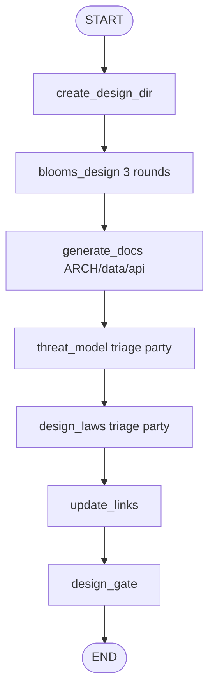
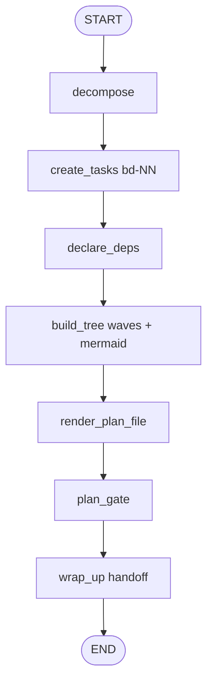

<!-- nav:top -->
[🏠 Wiki Home](README.md)

# Inception (the brainstorm subgraph)

Inception turns a raw feature idea into an approved, decomposed task plan. It is the
`brainstorm` subgraph (`packages/pdlc-graph/pdlc_graph/graphs/brainstorm/`), a chain of
four sub-phases — **Discover → Define → Design → Plan** — each ending in its own approval
gate. Start it with `/brainstorm <feature>`.

Each sub-phase is a compiled `StateGraph(PDLCState)` whose terminal node is its gate; the
parent (`brainstorm/__init__.py`) chains them `discover → define → design → plan`. The
sub-phases compile without an inner checkpointer so every `interrupt()` (questions and
gates) propagates to the top-level checkpointer and resumes across HTTP turns.

## Sketch vs Socratic

All question rounds in Inception go through `interaction.ask`. The cadence is set by
`state.interaction_mode` (CONSTITUTION §8):

- **Sketch** (default) — the agent drafts an answer per question from context and surfaces
  the batch for the human to edit. Drafts ride the interrupt payload.
- **Socratic** — one question at a time, answered from scratch.

Under `/night-shift` no round blocks: Sketch drafts are auto-accepted with no human turn.

## Discover (`discover.py`, steps 0–6)

Divergent ideation through synthesis, ending at the `discover_summary` gate.

- **Step 0 — Divergent ideation** (optional, gated on `enable_divergent_ideation`): Muse
  proposes one candidate idea per lens (Technical, UX, Business, Edge Cases).
- **Step 2 — Socratic discovery**: 3 rounds via `interaction.ask`, one round per `ask()`
  — Problem Statement, Future State / Key Capabilities, Acceptance Criteria. Atlas
  pre-drafts each answer (used as Sketch drafts).
- **Step 2a — Progressive Thinking party** (ALWAYS): `run_party(kind="progressive-thinking")`
  with Atlas + 8 (Neo, Echo, Phantom, Bolt, Friday, Muse, Pulse, Jarvis). The MOM +
  decision land in `party_results["progressive-thinking"]`.
- **Step 3 — Adversarial review**: Atlas (devil's advocate) surfaces one finding per
  dimension across 10 dimensions (assumption gaps, scope leaks, metric fragility, …).
- **Step 4 — Edge-case analysis**: Echo traces 6 categories (user-flow branches, boundary
  data, invalid input, permissions, concurrency, integration failures) and triages each
  into in-scope / out-of-scope / known-risk.
- **Step 4.5 — UX Discovery** (CONDITIONAL): runs only when a visual signal is present —
  `state.visual` truthy, or `domains` contains `visual`/`ui`/`ux` (`_has_visual_signal`).
  Muse leads 3 questions (look & feel, flow, state coverage) and attaches a visual
  companion (see below).
- **Steps 5–6 — Synthesis**: Atlas distills the whole `brainstorm_log` into a discovery
  summary (`render_discovery_summary`), persisted via the artifact port to
  `docs/pdlc/brainstorm/discovery_summary_<slug>_<date>.md`. Then `discover_gate` opens
  **gate #1 `discover_summary`**.

## Define (`define.py`, steps 7–8)

- **Step 7 — `define_prd`**: Atlas drafts each PRD section from the full brainstorm log
  (overview, problem, target user, MUST/SHOULD requirements, assumptions, acceptance
  criteria, a `US-001` user story, non-functional, known risks, out-of-scope). The
  deterministic `render_prd` assembles it; persisted to
  `docs/pdlc/prds/PRD_<slug>_<date>.md` → `prd_ref`.
- **Step 8 — `prd_gate`**: opens **gate #2 `prd_approve`**; records `prd_approved`.

## Design (`design.py`, steps 9–12)

- **Step 9 — `create_design_dir`**: sets `design_dir = docs/pdlc/design/<slug>`.
- **Step 9a — `blooms_design`**: Neo leads Bloom's Taxonomy questioning across 3 rounds
  (Mechanics → Apply → Trade-offs), one `ask()` per round.
- **Step 10 — `generate_docs`**: renders and persists the 3 core docs — `ARCHITECTURE.md`
  (`render_architecture`), `data-model.md` (`render_data_model`), `api-contracts.md`
  (`render_api_contracts`) — into `design_docs`.
- **Step 10.5 — `threat_model`**: Phantom triage via `triage_level(signals)`
  (skip/lite/full). On lite/full convene a `threat-model` party (lite = Phantom solo;
  full = Phantom + Neo + Bolt + Atlas), render `threat-model.md` (`render_threat_model`)
  → `threat_model_ref`. Signals are read from `state.threat_signals` (default `[True,
  True, False]` so the full path stays exercisable).
- **Step 10.6 — `design_laws`**: Muse triage. On lite/full convene a `design-laws`
  roundtable (lite = Muse solo; full = Muse + Neo + Echo + Phantom), render `ux-review.md`
  (`render_ux_review`) → `ux_review_ref`. Signals from `state.ux_signals`.
- **Step 11 — `update_links`**: folds all five artifact links into `design_docs`.
- **Step 12 — `design_gate`**: opens **gate #3 `design_docs_approve`** (the 5-artifact
  package); records `design_approved`.

`triage_level` maps yes-signals to effort: 0 yes → skip, 1 → lite (lead solo), 2–3 → full
party.

## Plan (`plan.py`, steps 13–19)

- **Step 13 — `decompose`**: a deterministic 4-task skeleton (data-model → api → ui →
  tests) with dependency indices; Neo drafts each implementation note. Tasks are labelled
  `epic:<slug>`, `story:US-001`, `domain:<backend|frontend|devops>`.
- **Step 14 — `create_tasks`**: creates each task through the task-store port, capturing
  `bd-NN` external ids.
- **Step 15 — `declare_deps`**: declares each blocker → blocked edge on the store.
- **Step 16 — `build_tree`**: computes topological wave order (a task's wave =
  1 + max(dep waves)) and a Mermaid `graph TD` dependency tree; annotates each task with
  its `wave`.
- **Step 17 — `render_plan_file`**: `render_plan` → persisted to
  `docs/pdlc/prds/plans/plan_<slug>_<date>.md` → `plan_ref`.
- **Step 18 — `plan_gate`**: opens **gate #4 `beads_tasklist_approve`** with the wave
  dependency tree attached as a visual companion (`task_count`, `wave_count`); records
  `plan_approved`.
- **Step 19 — `wrap_up`**: writes the Construction handoff (`next_action: "Start
  Construction — run /build"`).

## The visual companion

pdlcflow replaces the upstream `localhost:7352` mockup server with a panel rendered in the
**same browser view** as the chat (`apps/studio/.../BrainstormVisualCompanion.tsx`). There
is no extra server and no new engine endpoint: a node attaches a `visual` spec to its
`interrupt()` payload (`pdlc_graph/visual.py`), it rides `pending.payload.visual` → the
gate store → the WS frame, and React draws it beside the question.

A spec is `{"screens": [...]}`. Screen builders (all pure):

- `options_screen(title, options, ...)` — A/B/C selectable cards; clicking one answers
  that question. Used by **UX Discovery** (one option screen per question: look & feel,
  user flow, state coverage).
- `mermaid_screen(title, mermaid, ...)` — a Mermaid diagram. Used by the **Plan gate** to
  surface the task dependency tree ("same-wave tasks run in parallel").
- `mockup_screen(title, body, ...)` — a titled wireframe/preview block.

---
<!-- nav:bottom -->
⏮ [First: Overview](01-overview.md) · ◀ [Prev: Party Mode](07-party-mode.md) · [🏠 Home](README.md) · [Next: Construction (the build subgraph)](09-construction.md) ▶ · [Last: API Reference](16-api-reference.md) ⏭
