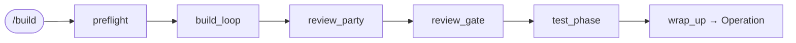
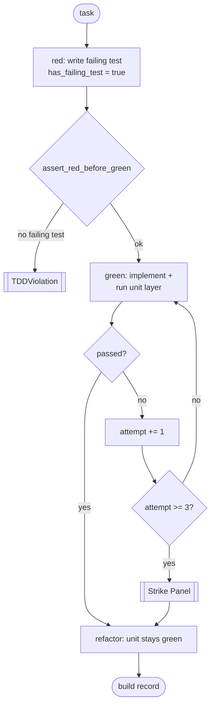

<!-- nav:top -->
[🏠 Wiki Home](README.md)

# Construction (the build subgraph)

Construction implements the approved plan: it walks the dependency waves, builds each task
under strict TDD, cross-reviews the result, and runs the 7 test layers. It is the `build`
subgraph (`packages/pdlc-graph/pdlc_graph/graphs/build/`). Start it with `/build`.

The chain is `preflight → build_loop → review_party → review_gate → test_phase → wrap_up`
(`build/__init__.py`), compiled without an inner checkpointer so the loop's `interrupt()`
sites bubble up to the top-level checkpointer.

## Preflight (`preflight.py`)

Enters Construction / Build and seeds bookkeeping: `current_wave = 1`, empty `test_loop`,
`strike_history`, and `build_log`. `compute_waves(tasks)` derives the topological wave
order from `depends_on` (honouring the `wave` annotation that Plan already set), so
same-wave tasks can run in parallel.

## The wave / TDD build loop (`loop.py`)

`build_loop` is a single, replay-safe node that walks every wave and, per task, runs the
TDD micro-loop. All work is deterministic on replay (the LLM and test-runner ports are
pure, party calls recompute), so the node survives interrupt/resume.

### TDD enforcement (TDDViolation)

The rule "no implementation without a failing test first" is structural
(`test_runner_port.py`). The loop writes the failing test (red), then calls
`assert_red_before_green(has_failing_test, task_id)` before any implementation — if no
failing test was recorded it raises `TDDViolation`. Then it implements (green) and runs
the unit layer.

### 3-Strike → Strike Panel

The green phase auto-fixes up to a cap. On the **3rd** failed attempt the loop convenes the
**Strike Panel** — `run_party(kind="strike-panel")` with Neo + Echo + the domain agent —
which surfaces 3 ranked options:

1. Approach 1 (recommended, by Neo)
2. Approach 2 (by Echo)
3. Escalate — take the wheel (human)

The run then `interrupt()`s (`mode: "strike_panel"`) for the human to pick `0/1/2`; the
chosen approach fixes the failure and the strike counter resets. Under `/night-shift` the
recommended approach (index 0) is auto-picked. A hard safety cap of 6 attempts backs the
3-Strike logic. The domain agent is chosen from the task's `domain:` label (backend→Bolt,
frontend→Friday, devops→Pulse, ux→Muse, product→Atlas; default Bolt).

### Construction parties

The loop runs two party kinds via the generic orchestrator:

- **Wave Kickoff** (`kind="wave-kickoff"`): once per wave that has **≥2 tasks**, Neo-led
  with the wave's domain agents — surfaces hidden deps + ordering.
- **Design Roundtable** (`kind="design-roundtable"`): per-task, when the task spans more
  than one domain or carries `needs_design` (`_needs_roundtable`). Neo + Echo + domain.

## Review (`review.py`)

`review_party` runs the **Party Review** — the always-on reviewers Neo (Architecture),
Echo (Test coverage), Phantom (Security), Jarvis (Documentation), plus Muse when a
`ux_review_ref` exists. It renders `REVIEW.md` (`render_review`), persisted to
`docs/pdlc/reviews/REVIEW_<slug>_<date>.md` → `review_ref`.

`review_gate` opens **gate #5 `review_md_approve`** — the single Construction approval
gate. If the review carries Critical findings the payload is flagged `blocking`, so under
night-shift the gate refuses rather than auto-approving; records `review_approved`.

## The 7 test layers (`test_phase.py`)

After review, `test_phase` runs all 7 PDLC layers through the injectable test-runner port:

| Layer | Required? |
|---|---|
| unit | yes |
| integration | yes |
| contract | no |
| e2e | no |
| security | yes |
| perf | no |
| ux | no |

If any **required** layer (unit / integration / security) fails and night-shift is *not*
active, the node `interrupt()`s (`mode: "test_failures"`) for the human to accept / fix /
defer. Under night-shift it proceeds. Results land in `construction_test_results`.

`wrap_up` then marks `construction_complete` and writes the Operation handoff
(`next_action: "Start Operation — run /ship"`).

## The test-runner port

The loop never shells out directly — it calls `run_layer(layer, target, attempt=,
fail_until=)` (`test_runner_port.py`). The default `SimulatedTestRunner` is deterministic
and offline: it fails the first `fail_until` attempts of a target, then passes — which is
how a task with `simulate_failures: 3` deterministically trips the Strike Panel, and how
the whole loop runs in CI with no project checkout. The engine injects a subprocess-backed
runner at boot via `set_test_runner`. Determinism is load-bearing: `run_layer` must be a
pure function of its arguments because `build_loop` replays on every resume.

---
<!-- nav:bottom -->
⏮ [First: Overview](01-overview.md) · ◀ [Prev: Inception (the brainstorm subgraph)](08-inception.md) · [🏠 Home](README.md) · [Next: Operation (the ship subgraph)](10-operation.md) ▶ · [Last: API Reference](16-api-reference.md) ⏭
