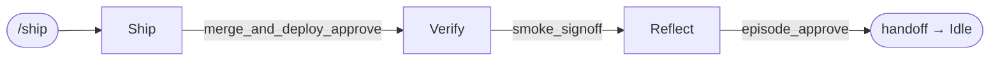
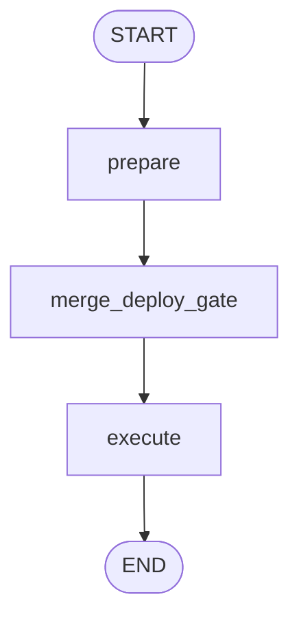
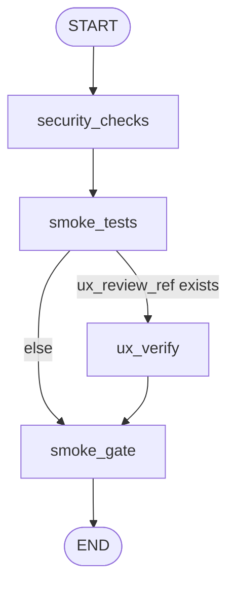
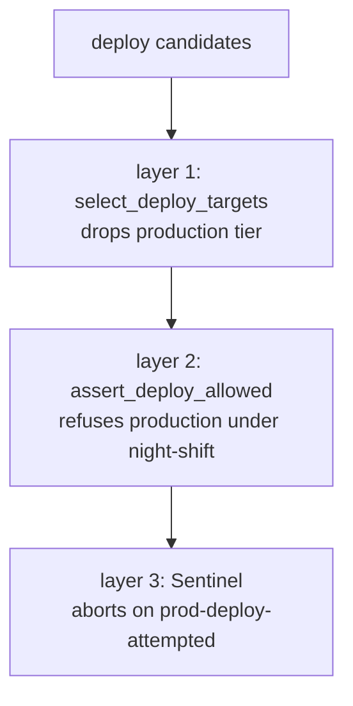

<!-- nav:top -->
[🏠 Wiki Home](README.md)

# Operation (the ship subgraph)

Operation releases the built feature: it versions and merges it, deploys, verifies the
live environment, and records a retrospective. It is the `ship` subgraph
(`packages/pdlc-graph/pdlc_graph/graphs/ship/`), composed as **Ship → Verify → Reflect**,
each ending in its own approval gate (#6, #7, #8). Start it with `/ship`.

The three segments are compiled subgraphs (no inner checkpointer) chained in
`ship/__init__.py`; their `interrupt()` sites propagate to the top-level checkpointer.
Note: `ship_graph` is the name `meta_graph` imports for the whole Operation phase.

## Ship (`ship.py`) — gate #6

Pulse leads: version, changelog, deploy-target selection, then merge + deploy.

- **`prepare`**: computes the next semantic version with `next_version(current, commits)`
  from **conventional commits** (`versioning.py`): a `BREAKING CHANGE`/`type!` → major,
  `feat` → minor, everything else → patch, ambiguous → minor. Drafts a CHANGELOG entry
  (`render_changelog`) → `changelog_ref`. Picks the deploy target via
  `select_deploy_targets(...)` (production is filtered out here — **layer 1** of the ban)
  and infers its tier (`infer_tier`).
- **`merge_deploy_gate`**: opens **gate #6 `merge_and_deploy_approve`** with the version,
  deploy target, tier, and changelog; records `merge_and_deploy_approved`.
- **`execute`** (only if approved): asserts the deploy is allowed (`assert_deploy_allowed`
  — **layer 2** of the ban), merges to main via the VCS port (**merge-commit only** — any
  squash/rebase/fast-forward raises `MergeStrategyError`), records the deploy in the
  register, and renders `DEPLOYMENTS.md` (`render_deployments`) → `deployments_ref`.

## Verify (`verify.py`) — gate #7

Pulse leads post-deploy verification.

- **`security_checks`**: Phantom runs a final sweep (dependency audit, secret scan,
  security headers) → `smoke_results["security"]`.
- **`smoke_tests`**: runs smoke checks against the deployed environment via the test-runner
  port — `http_health`, `user_journey`, `auth_flow`. The first two are **required**.
- **`ux_verify`** (conditional on `ux_review_ref`): Muse spot-checks the as-deployed UX.
- **`smoke_gate`**: opens **gate #7 `smoke_signoff`**. If a required check failed the
  payload is flagged `blocking`, so night-shift refuses; records `smoke_signed_off`.

## Reflect (`reflect.py`) — gate #8

Jarvis leads the retrospective and closes out the feature.

- **`retro_and_episode`**: synthesizes a retro grounded in the build log, construction test
  results, and review package (went-well / broke / improve), renders the permanent episode
  file (`render_episode`) → `episode_ref` at
  `docs/pdlc/memory/episodes/<id>_<slug>_<date>.md`.
- **`episode_gate`**: opens **gate #8 `episode_approve`** (approve to commit the episode);
  records `episode_approved`.
- **`metrics_and_wrapup`**: renders the metrics rollup (`render_metrics` — cycle days,
  test-pass %, review rounds, strikes, task count) → `metrics_ref`, sets
  `operation_complete`, **releases the roadmap claim** (`roadmap_claim = None`), and writes
  the Idle handoff (`next_action: "Run /brainstorm for the next feature"`).

## The three-layer production-deploy ban

Production deploys are never automated. The ban (`deploy_port.py`) is enforced
independently at three points so no single bug can open a path to prod:

1. **Filter at selection** — `select_deploy_targets` removes any production-tier
   environment from the candidate set before the gate ever sees it.
2. **Refuse at activate** — `assert_deploy_allowed(tier, night_shift=...)` raises
   `DeployBanError` if a production tier is reached under autonomous flow.
3. **Runtime abort** — the Sentinel evaluator's `prod-deploy-attempted` condition aborts a
   night-shift run.

Tier inference (`infer_tier`) uses token-boundary matching with a priority order, so
`pre-prod` / `non-prod` resolve to **pre-production** before the bare `prod` rule fires.
Valid tiers: dev, test, staging, pre-production, production.

---

---
<!-- nav:bottom -->
⏮ [First: Overview](01-overview.md) · ◀ [Prev: Construction (the build subgraph)](09-construction.md) · [🏠 Home](README.md) · [Next: Night Shift](11-night-shift.md) ▶ · [Last: Evals Framework](17-evals.md) ⏭
