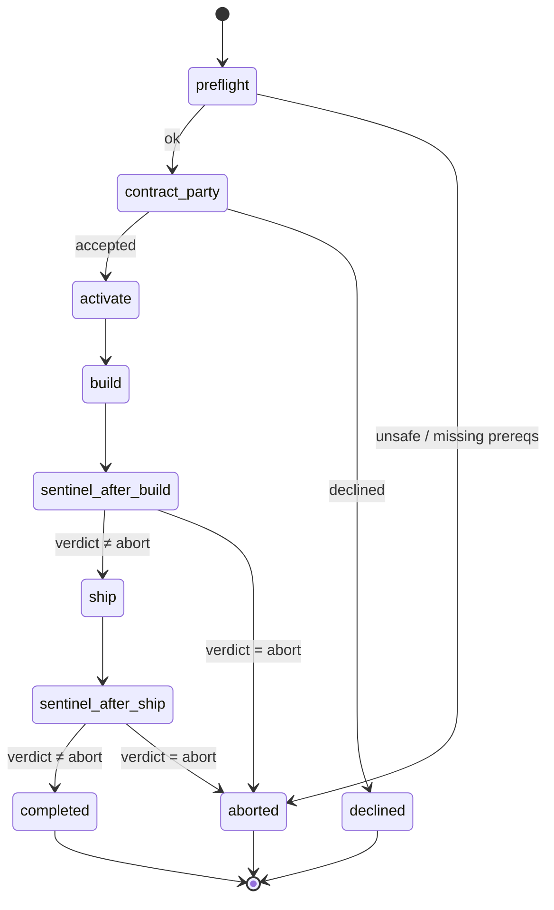

<!-- nav:top -->
[🏠 Wiki Home](README.md)

# Night Shift

Night Shift is pdlcflow's autonomous runtime: it drives a feature from
**Construction through Operation** (Build → Ship) without a human at the
keyboard, under the supervision of the deterministic **Sentinel** evaluator. The
subgraph is `packages/pdlc-graph/pdlc_graph/graphs/night_shift.py`; the verdict
logic is `packages/pdlc-graph/pdlc_graph/sentinel/evaluator.py`.

It is reachable via the `night-shift` command (and the `/night-shift` skill).
The meta-graph routes to this subgraph whenever `night_shift_active` is set.

## State machine



Stage by stage:

- **preflight** validates the run can start autonomously. It aborts if there is
  no feature, no tasks (Inception must have run first), or — critically — if the
  target environment infers to `production`.
- **contract_party** is the **single human gate** (see below).
- **activate** sets `night_shift_active=True`, assigns a `night_shift_run_id`,
  and moves the phase to Construction.
- **build** runs the full Construction subgraph (`build_graph`).
- **sentinel_after_build** evaluates the Sentinel verdict and routes to `ship`
  or `aborted`.
- **ship** runs the full Operation subgraph (`ship_graph`).
- **sentinel_after_ship** evaluates again and routes to `completed` or
  `aborted`.
- **completed / aborted / declined** are the three terminal outcomes; each
  clears `night_shift_active` and records `night_shift_outcome`.

## The single human gate: Contract Party

Inside a night-shift run, every approval gate inside Build and Ship
auto-approves — *except one*. The **Contract Party** is the only human
checkpoint. It is implemented as a raw LangGraph `interrupt(...)`, **not** the
normal `gates.approval_gate`. This matters: the standard gate auto-resolves when
`night_shift_active` is set, but a raw `interrupt` always pauses, so the human
must explicitly accept the autonomous contract before anything runs.

The interrupt payload presents the feature, the target environment, and a
summary; the human's response sets `night_shift_contract_accepted`. If accepted,
the run proceeds to `activate`; if declined, it routes to `declined` and stops.
Because the interrupt must survive the pause, `build_night_shift(checkpointer=…)`
requires a checkpointer (MemorySaver or PostgresSaver) so the Contract Party is
resumable.

## The Sentinel evaluator

Sentinel is a **deterministic Python evaluator**, not an LLM (its soul spec is
loaded for completeness only). It fires on the internal edges after Build and
after Ship. `_state_md(state)` synthesizes a marker document from run state, and
`evaluate(run_state, state_md)` scans it for `ns-progress:` and `ns-abort:`
markers and returns a fixed-shape verdict:

```json
{"ok": true,  "verdict": "continue"}
{"ok": true,  "verdict": "complete"}
{"ok": false, "verdict": "abort", "reason": "<condition-id>"}
```

Evaluation order:

1. Any `ns-abort:<cond>` marker whose condition is in `ABORT_CONDITIONS` → abort
   with that reason.
2. An `ns-progress:complete` marker → `complete` (loop exits cleanly).
3. Stagnation check (no new progress + no abort) → abort with `stagnation`.
   (The Phase A stub always returns False, so no false aborts during scaffold
   runs.)
4. Otherwise → `continue`.

`_state_md` derives markers from state: `construction_complete` →
`ns-progress:build-done`; `operation_complete` → `ns-progress:complete`; any
required smoke check that failed → `ns-abort:smoke-failed`. Existing
`state["ns_markers"]` are included verbatim.

### Abort conditions

The `ABORT_CONDITIONS` set is ported verbatim from upstream and is a breaking
change to extend:

```
critical-security      p0-ux                  semver-ambiguous
merge-conflict         smoke-failed           prod-deploy-attempted
wrong-env-deploy       env-untagged           review-fix-cycles-3
build-loop-iteration-cap   stagnation         deploy-url-unknown
```

## Auto-approval of inner gates

Once `activate` sets `night_shift_active`, the gates *inside* Build and Ship
(`review_md_approve`, `merge_and_deploy_approve`, `smoke_signoff`,
`episode_approve`, etc.) auto-resolve rather than pausing. Party consensus nodes
likewise auto-pick (see [Party Mode](07-party-mode.md)). The Contract Party
remains the lone human checkpoint because it uses a raw `interrupt`.

## Live verdict streaming to mission control

The two Sentinel nodes call `emit_event("night_shift.verdict", state, {"stage":
…, **verdict})` so the actual verdict is streamed live — the instrumentation
decorator cannot see the return value, hence the explicit emit. These frames,
alongside `night_shift.started` / `night_shift.completed` /
`night_shift.aborted`, are published over the thread WebSocket
(`/ws/threads/{thread_id}`) and rendered in the Atlas Console mission-control
panel.

## Three-layer production-deploy ban

A night-shift run can never deploy to production. The ban is enforced at three
independent layers:

1. **Ship candidate filtering** — `select_deploy_targets` pre-filters production
   environments out of the candidate set.
2. **Preflight / contract refusal** — `preflight` aborts when the target
   environment infers to `production` (`infer_tier(target) == "production"`),
   before the Contract Party is even reached.
3. **Sentinel abort** — if a production deploy is somehow attempted, the marker
   `ns-abort:prod-deploy-attempted` is in `ABORT_CONDITIONS`, so the Sentinel
   aborts the run.


---
<!-- nav:bottom -->
⏮ [First: Overview](01-overview.md) · ◀ [Prev: Operation (the ship subgraph)](10-operation.md) · [🏠 Home](README.md) · [Next: Utility Commands](12-utilities.md) ▶ · [Last: API Reference](16-api-reference.md) ⏭
