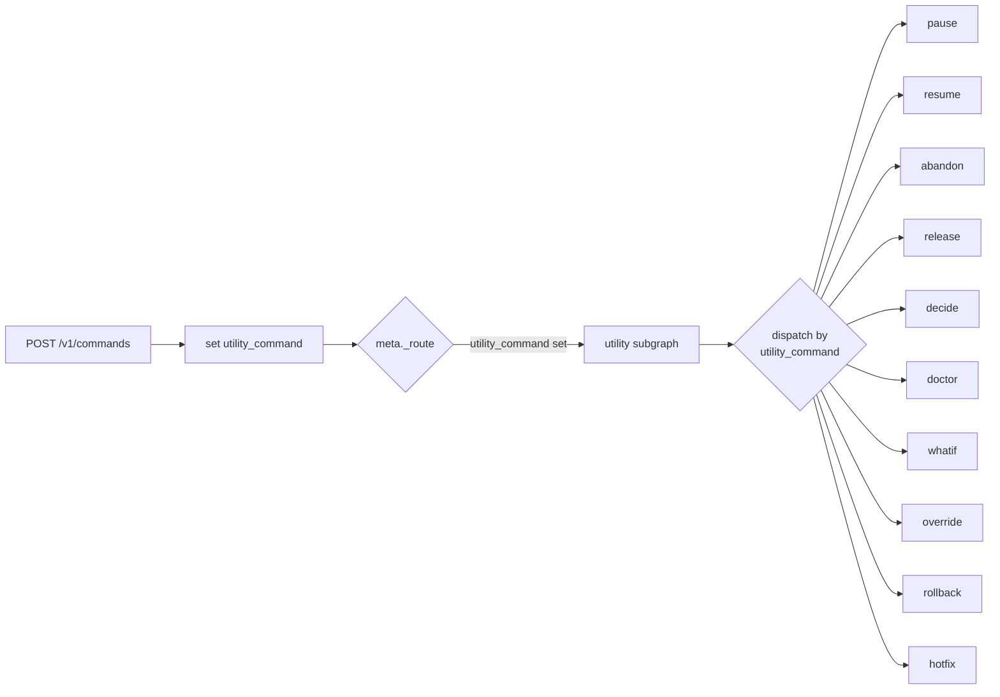

<!-- nav:top -->
[🏠 Wiki Home](README.md)

# Utility Commands

pdlcflow exposes **10 utility commands** that operate outside the four-phase
lifecycle (Initialization → Inception → Construction → Operation). They cover
pausing/resuming work, recording decisions, running health checks, exploring
hypotheticals, overriding safety blocks, and emergency recovery.

Every utility is invoked the same way as any other command — a single
`POST /v1/commands` — and they all route through one place: the **utility
subgraph**.

## How utilities route

The command route (`services/pdlc-engine/app/routes/commands.py`) recognises a
fixed set of utility commands:

```python
_UTILITY_COMMANDS = {
    "decide", "whatif", "doctor", "rollback", "hotfix",
    "abandon", "release", "override", "pause", "resume",
}
```

When the request `command` is one of these, the engine sets
`state["utility_command"] = command` in the initial `PDLCState`. The meta-graph
router (`packages/pdlc-graph/pdlc_graph/graphs/meta.py`) then sends the thread to
the `utility` subgraph **regardless of the resting phase**:

```python
def _route(state):
    if state.get("night_shift_active"):
        return "night_shift"
    if state.get("utility_command"):
        return "utility"
    return {"Initialization": "init", "Inception": "brainstorm",
            "Construction": "build", "Operation": "ship"}.get(...)
```

Inside the utility subgraph
(`packages/pdlc-graph/pdlc_graph/graphs/utility/__init__.py`) a conditional edge
from `START` dispatches `state["utility_command"]` to one per-command node; an
unknown command falls through to an `_unknown` node that returns an error
result. Each node returns a state patch whose `utility_result` summarises the
outcome.



**Pure vs interrupting.** Most utilities are *pure* — one synchronous node that
completes inside the single `POST /v1/commands` call (`pending` comes back
`null`). Two utilities **interrupt** for a human turn and must be finished via
`POST /v1/approval-gates/{id}/resolve`:

- `/override` — Tier-1 double-RED confirmation.
- `/hotfix` — one emergency-deploy confirmation.

Under **night-shift** (`night_shift_active`) the interrupting utilities do not
pause: `/hotfix` auto-proceeds and `/override` refuses outright (it is
human-only).

## Invocation shape

```bash
curl -sX POST http://localhost:8000/v1/commands \
  -H 'content-type: application/json' \
  -d '{
    "command": "doctor",
    "org_id":     "00000000-0000-0000-0000-000000000000",
    "project_id": "11111111-1111-1111-1111-111111111111"
  }'
```

Command-specific inputs ride in `seed_state.utility_args` (the node reads
`state["utility_args"]`). For example, to record a decision:

```json
{
  "command": "decide",
  "org_id": "…", "project_id": "…",
  "seed_state": { "utility_args": { "title": "Adopt LangGraph", "rationale": "…" } }
}
```

Tenancy keys (`org_id`, `project_id`) and the `utility_command` flag are always
re-asserted by the engine and cannot be overridden by `seed_state`.

---

## Lifecycle utilities

These are pure state transitions — no interrupt, no git, no network.
(`pause.py`, `resume.py`, `abandon.py`, `release.py`.)

### `/pause`

Cleanly pauses the active feature. Sets `paused = True`, writes a
`last_checkpoint` note (`"Paused / <phase> / <iso-ts>"`), and **leaves all
artifacts intact** so `/resume` can pick up exactly where work stopped.
`utility_result` reports the feature, phase, sub_phase, and checkpoint.

```json
{ "command": "pause", "org_id": "…", "project_id": "…" }
```

### `/resume`

Clears `paused`, records a new `Resumed / …` checkpoint, and reports the prior
`from_checkpoint` it picks up from. No git rebase or task reclaim — the bounded
hermetic port only flips the flag and reports.

### `/abandon`

Marks the feature `abandoned = True` and **releases its roadmap claim**
(`roadmap_claim = None`). Per the foundation contract it does **not** delete
artifacts — the PRD, design docs, and build log remain for the record / the
abandonment episode (`artifacts_preserved: True`). Accepts
`utility_args.feature` and `utility_args.reason`.

### `/release`

Force-releases a stuck roadmap-level claim (an admin recovery) so the feature
returns to the ready queue. Reads the held claim from state, surfaces it as
`released_claim` (with `feature_id`) for the audit trail, and clears
`roadmap_claim`. If no claim was held it reports nothing-to-release. Accepts
`utility_args.reason`.

---

## Decisions & safety utilities

### `/decide`

Records a decision in the PDLC Decision Registry. Reads
`utility_args.{title, rationale}`; if the rationale is missing, **Atlas** drafts
one via the LLM port. Appends a new `{id: "D-N", title, rationale, date}` entry
to the append-only `decisions` list, re-renders `DECISIONS.md`, and persists it
to `decisions_ref` via the artifact port
(`docs/pdlc/memory/DECISIONS.md`). Emits a `decision.recorded` event.

```json
{
  "command": "decide", "org_id": "…", "project_id": "…",
  "seed_state": { "utility_args": { "title": "Use merge-commit only", "rationale": "…" } }
}
```

### `/doctor`

A **read-only** bounded PDLC health check. Inspects in-memory state (no git, no
filesystem scan) and reports pass/fail per check:
`has_feature`, `has_phase`, `not_paused`, `not_abandoned`,
`has_roadmap_claim`, `no_blockers`. Builds a `doctor_report`, renders it to
`doctor_ref` (`docs/pdlc/doctor-report.md`), and summarises
`{passed, failed, healthy}` in `utility_result`.

```json
{ "command": "doctor", "org_id": "…", "project_id": "…" }
```

### `/whatif` (read-only)

Explores a hypothetical scenario **without mutating any project state**. Reads
`utility_args.scenario`, has **Neo** analyse implications on architecture,
scope, effort, and risk via the LLM port, renders the analysis to
`whatif_ref` (`docs/pdlc/mom/MOM_whatif_<slug>.md`), and returns **only**
`whatif_ref` + `utility_result` (`read_only: True`). It is contractually
asserted never to touch `paused`, `abandoned`, `decisions`, or `roadmap_claim`.

```json
{
  "command": "whatif", "org_id": "…", "project_id": "…",
  "seed_state": { "utility_args": { "scenario": "What if we drop Postgres for SQLite?" } }
}
```

### `/override` (double-RED — interrupting)

A **Tier-1 safety override** bypasses a hard safety block, so it demands an
explicit human confirmation. The node `interrupt()`s for the phrase
**`RED RED`** and only confirms on an exact (case-insensitive) match; the
attempt (confirmed or cancelled) is appended to `override_log`.

- **First call** returns a pending interaction
  (`mode: "override_confirm"`); resolve it with the answer.
- **Night-shift:** override is human-only, so the node **refuses without
  interrupting** — it records an unconfirmed entry and returns
  `{"refused": "night-shift"}`.

```bash
# 1. start the override → returns pending {id, kind:"user_input_required"}
curl -sX POST .../v1/commands -d '{"command":"override","org_id":"…","project_id":"…",
  "seed_state":{"utility_args":{"reason":"emergency deploy"}}}'

# 2. confirm with RED RED (question-round resume shape)
curl -sX POST .../v1/approval-gates/<id>/resolve -d '{"answers":["RED RED"]}'
```

The resume value may be a raw string or `{"answers":[…]}` (the engine's
question-round shape).

---

## Recovery utilities

### `/rollback`

Reverts a shipped feature to `utility_args.to_version`. Renders a rollback note,
persists it to `rollback_ref` (`ROLLBACK.md`), records a **revert deploy** in
the in-memory deploy register (so the deployments view reflects the rolled-back
version), and updates `state["version"]`. Pure — no interrupt, no real
git/deploy. Reads `utility_args.{to_version, reason}`; the environment/tier come
from `state.deploy_target`.

```json
{
  "command": "rollback", "org_id": "…", "project_id": "…",
  "seed_state": { "deploy_target": "staging",
                  "utility_args": { "to_version": "v1.2.0", "reason": "regression" } }
}
```

### `/hotfix` (one confirmation — interrupting)

An emergency **compressed build → ship** (Pulse leads upstream). Skips
inception/design and runs a single-confirmation deploy:

1. `interrupt()` for one confirmation (`mode: "hotfix_confirm"`). A truthy
   resume (`yes`/`y`/`confirm`/`true`/`ok`, or `{"approved":true}` /
   `{"confirmed":true}` / `{"answers":["yes"]}`) proceeds; anything else
   aborts (`{"aborted": True}`).
2. On proceed it enforces the **Layer-2 production-deploy ban**
   (`assert_deploy_allowed(tier, night_shift=…)`), records the deploy, and
   renders a `HOTFIX.md` record to `hotfix_ref`.

Under **night-shift** there is no interrupt — it auto-proceeds (`auto: True`),
but the production-deploy ban still applies.

```bash
# start
curl -sX POST .../v1/commands -d '{"command":"hotfix","org_id":"…","project_id":"…",
  "seed_state":{"deploy_target":"staging","version":"v1.2.1",
                "utility_args":{"summary":"patch auth bug"}}}'
# confirm
curl -sX POST .../v1/approval-gates/<id>/resolve -d '{"answers":["yes"]}'
```

---

## Result shape

Every utility returns its outcome under `utility_result` in the final graph
state (surfaced on the `thread.completed` WebSocket frame summary where
applicable). Each result carries `"command": "<name>"` plus command-specific
fields (e.g. `doctor → {passed, failed, healthy}`,
`override → {confirmed, outcome}`, `hotfix → {shipped, env, tier, version}`).


---
<!-- nav:bottom -->
⏮ [First: Overview](01-overview.md) · ◀ [Prev: Night Shift](11-night-shift.md) · [🏠 Home](README.md) · [Next: Studio — the browser UI](13-studio.md) ▶ · [Last: API Reference](16-api-reference.md) ⏭
