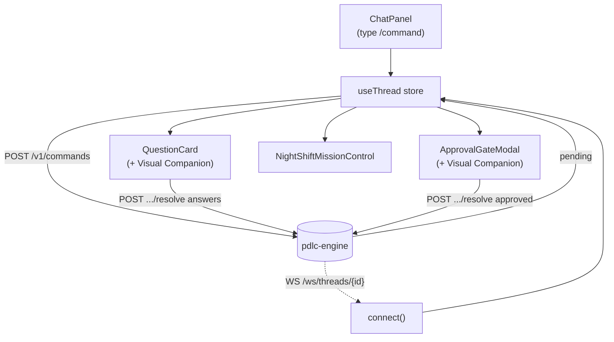

<!-- nav:top -->
[🏠 Wiki Home](README.md)

# Studio — the browser UI

Studio is the React + Vite + Tailwind single-page app in `apps/studio/`. It is
the operator's chat-first front end to the engine: you type a slash command,
answer the question rounds the graph raises, approve the gates, watch a
night-shift run in mission control, and pivot to the **Atlas Console** for
analytics — all in one bundle.

## URLs

| Mode | URL | Notes |
|---|---|---|
| Dev (no Docker) | `http://localhost:5173` | `pnpm dev` (Vite). Proxies `/v1` → `:8000` and `/ws` → `ws://:8000` (`vite.config.ts`). |
| Compose | `http://localhost:8080` | `studio` service (nginx), behind the same engine API. |

The Vite dev proxy means the browser talks to `/v1/...` and `/ws/...` on its own
origin; no CORS config is needed in dev. The API base is hard-coded to `/v1`
(`lib/api.ts`) and the WebSocket URL is derived from `window.location`
(`lib/ws.ts`), so the same build works in both modes.

## Layout

`AppShell.tsx` is the frame: a top bar with Org / Squad / Initiative / Project
switchers, a phase pill, a **theme toggle** (light/dark with system-preference
detection), and an **Atlas Console** link (`/admin/live`). The left
`SideDrawer` and a bottom `StatusLine` round out the shell. Routes:

- `/` — project switcher (`routes/index.tsx`).
- `/projects/:id` — the Studio working view (`routes/projects/[id].tsx`).
- `/admin/*` — the Atlas Console (see [Monitoring](14-monitoring.md)).



## 1. Starting a command — ChatPanel

`ChatPanel.tsx` is the prompt at the bottom of the project view. Type a slash
command, e.g.:

```
/brainstorm dark mode
```

It is parsed `\/?(\w[\w-]*)\s*(.*)` into `command = "brainstorm"` and
`feature = "dark mode"`. The store's `start()` calls
`api.invokeCommand({ command, org_id, project_id, feature, interaction_mode })`
(`useThread.ts`), defaulting `interaction_mode` to `socratic`. The `org_id` /
`project_id` come from the store. For commands that drive UX Discovery, the
store seeds `seed_state: { visual: true }` so the visual companion fires.

The response's `thread_id` is stored and the view subscribes to that thread's
WebSocket channel. The transcript shows your command plus a system line
describing the first `pending` interaction (or "Thread completed.").

## 2. Answering question rounds — QuestionCard

When the graph hits a Socratic/Sketch/Bloom's/UX-Discovery `interrupt()`, the
pending interaction has `kind: "user_input_required"`. `QuestionCard.tsx`
renders one text input per `payload.questions[i]` (pre-filled from any
`payload.drafts[i]`). Submitting calls the store's `answer(answers)` which POSTs
`{ answers: [...] }` to `/v1/approval-gates/{id}/resolve`.

**Interaction modes** (set in the CONSTITUTION §8, or via the command's
`interaction_mode`): **Sketch** batches several drafted questions at once;
**Socratic** asks one at a time. Studio defaults new commands to `socratic`.

### Visual companion

When the interrupt payload carries a `visual` spec
(`payload.visual.screens[]`), `BrainstormVisualCompanion.tsx` renders beside the
questions. `options` screens are **clickable option cards**: clicking a card
calls `onSelect(key, title)`, which fills the matching answer slot (screen key
`q0` → question index 0). It also renders `mermaid` screens (e.g. the Plan
dependency tree) and `mockup` bodies. The visual spec rides the existing
interrupt payload — there is no separate companion server.

## 3. Approval gates — ApprovalGateModal

When the graph opens one of the 8 approval gates, the pending interaction has
`kind: "approval"` and a `gate_kind` (e.g. `prd_approve`, `review_md_approve`,
`merge_and_deploy_approve`). `ApprovalGateModal.tsx` is a centered modal showing
the `gate_kind`, an optional `payload.summary`, and **Approve / Reject**
buttons. Resolving calls `resolveApproval(approved, comment)` →
POST `{ approved, comment }` to the resolve endpoint. If the gate payload
carries a `visual` spec (e.g. the Plan dependency tree), the companion renders
alongside in the modal.

## 4. Night-shift mission control

For a `/night-shift` run, `NightShiftMissionControl.tsx` appears in the project
view. The **Contract Party** is the one human gate
(`gate_kind: "night_shift_contract"`), rendered through the shared
`ApprovalGateModal`. The panel shows:

- The run lifecycle line:
  `preflight → contract party → activate → build → ship → reflect`.
- A status pill (`Awaiting Contract Party` / `Running…` / `Completed` /
  `Aborted` / `Declined`), coloured by phase.
- The outcome + abort reason + shipped version/tier, read from the
  `thread.completed` summary.
- **Sentinel verdicts** streamed live: each `night_shift.*` frame is appended;
  `verdict === "abort"` rows render in red.

The panel is shown while the contract gate is open, once an outcome exists, or
once any verdict has arrived (`ProjectView` derives `isNightShift`).

## 5. The thread WebSocket

`lib/ws.ts` `connect({ threadId, onFrame })` opens
`ws(s)://<host>/ws/threads/{thread_id}` with exponential-backoff
auto-reconnect. `ProjectView` wires the frames into the store:

| Frame `type` | Handling |
|---|---|
| `hello` | connection ack (ignored) |
| `interaction.opened` | `setPending(frame.interaction)` — keeps the view in sync if the graph advances out-of-band |
| `thread.completed` | `setPending(null)` + `setResult(frame.summary)` |
| `night_shift.*` | `appendVerdict(frame)` (started / verdict / completed / aborted) |
| `token`, `status` | forward-compatible (token streaming not yet wired) |

Because the bus **replays** recent history on connect, a client attaching after
a gate opened still sees it.

## 6. Switching to the Atlas Console

Click **Atlas Console** in the top bar (or the link on the home page) to reach
`/admin/*`. The console tabs (`routes/admin/layout.tsx`) are: **Live,
Initiatives, Domains, Squads, Agents, Features, Exports, Models** — all
org-scoped via the session store. See [Monitoring](14-monitoring.md) for what
each renders.


---
<!-- nav:bottom -->
⏮ [First: Overview](01-overview.md) · ◀ [Prev: Utility Commands](12-utilities.md) · [🏠 Home](README.md) · [Next: Monitoring & Analytics](14-monitoring.md) ▶ · [Last: API Reference](16-api-reference.md) ⏭
