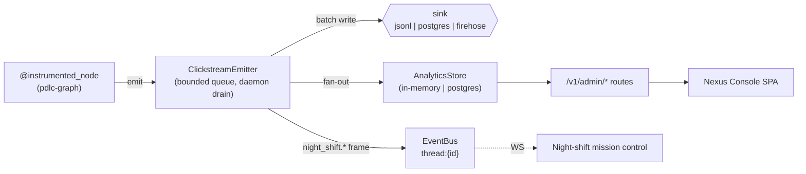

<!-- nav:top -->
[🏠 Wiki Home](README.md)

# Monitoring & Analytics

pdlcflow instruments every graph node with a clickstream of typed events,
feeds them into an analytics read store, and surfaces rollups through the
**Nexus Console** admin API + SPA. This page covers the 40-event taxonomy, the
tenancy/traceability dimensions every event carries, the analytics pipeline, the
admin routes, the cross-org ban, and live night-shift verdicts.

## The 40-event taxonomy

Every event the clickstream emits is one of **40 typed event types in 16
categories**, defined in `packages/event-schema/event_schema/registry.md` (the
source of truth) and `envelope.py` (`EVENT_TYPES`). Categories and counts:

| Category | Count | Examples |
|---|---|---|
| Session | 3 | `session.opened`, `session.resumed`, `session.closed` |
| Phase | 3 | `phase.entered`, `phase.exited`, `phase.transition` |
| Sub-phase | 2 | `subphase.entered`, `subphase.exited` |
| Step | 1 | `step.completed` |
| Skill | 1 | `skill.invoked` |
| Agent | 2 | `agent.invoked`, `agent.responded` |
| Approval gate | 2 | `gate.opened`, `gate.resolved` |
| Party meeting | 3 | `party.opened`, `party.pitch_received`, `party.consensus_reached` |
| Tool | 2 | `tool.invoked`, `tool.blocked` |
| Test | 3 | `test.run`, `test.passed`, `test.failed` |
| Strike | 2 | `strike.recorded`, `strike.panel_convened` |
| Deploy | 3 | `deploy.requested`, `deploy.succeeded`, `deploy.blocked` |
| Night-shift | 4 | `night_shift.started/verdict/completed/aborted` |
| Decision / override | 2 | `decision.recorded`, `override.invoked` |
| LLM | 1 | `llm.tokens_spent` |
| Context / UI / error | 3 | `context.warning`, `ui.viewed`, `error` |
| Admin / audit | 1 | `admin.access.denied` |

Adding an event requires a synced change across `EVENT_TYPES`, a typed payload
class, this registry, and a CI check (`scripts/check_event_registry.py`).

**PII rule:** payloads carry **references** (S3 keys, UUIDs, route names),
never raw prompts, messages, or artifact contents.

## Dimensions carried on every event

The `EventEnvelope` carries two groups of dimensions so a single event can be
pivoted many ways:

**Tenancy / org structure:** `org_id`, `squad_id`, `initiative_id`,
`application_id`, `project_id`, `repository`, `domains[]`.

**Feature traceability** (Phase G enrichment): `roadmap_id` (`F-NNN`),
`prd_id`, `user_story_id` (`US-001`), `plan_step`. Plus correlation:
`session_id`, `thread_id`, `actor`, `correlation_id`.

These let rollups drill from an initiative all the way down to a single roadmap
item, PRD, user story, or plan step — not just the application. PII is stripped
before emission.

## The clickstream pipeline



- **Emitter** (`app/clickstream/emitter.py`): a bounded
  `queue.Queue(maxsize=10_000)`, fire-and-forget — `emit_envelope` never blocks
  (drops oldest when full). A daemon thread drains in batches of up to 200 to
  the durable **sink** *and* fans each batch into the **analytics store**.
  Telemetry never raises into a node. Wired at boot via `wire_emitter(settings)`,
  which also pushes the emitter into pdlc-graph's `instrumentation.set_emitter`
  so decorated nodes emit without a runtime dependency on the engine.
- **Sinks** (`app/clickstream/sinks/`): `JsonlFileSink` (default),
  `PostgresSink` (inserts event rows incl. traceability columns), or
  `FirehoseSink`. Selected by `PDLC_CLICKSTREAM_SINK`.
- **Night-shift fan-out:** `night_shift.{started,verdict,completed,aborted}`
  events are mirrored to the thread's WebSocket channel (`thread:{id}`) so the
  mission-control panel streams Sentinel verdicts live (node-enter noise is
  skipped).

## The analytics read store

`app/analytics/store.py` — `InMemoryAnalyticsStore` by default; a Postgres-backed
store (`postgres_store.py`) is injected at boot under
`PDLC_ANALYTICS_BACKEND=postgres`. Both answer the same interface:

- `rollup(org_id, dimension, frm?, to?)` — group + aggregate
  `{key, events, tokens, usd}`, sorted by event count. Valid dimensions:
  `initiative`, `application`, `squad`, `domain` (explodes `domains[]`),
  `roadmap`, `user_story`, `agent` (from `payload.agent_persona`).
  Tokens = `tokens_in + tokens_out`; usd = `usd_estimate` from the payload.
- `feature_timeline(org_id, roadmap_id)` — every event for one `F-NNN` in
  chronological order (the replayable time-travel view).
- `live(org_id, limit)` — the most recent N events, newest first.
- `totals(org_id)` — `{events, tokens, usd}` for the org.

**Idempotent ingest:** the store dedups on `event_id`, so migration backfill
(which uses deterministic uuid5 ids) can be re-run with no double-counting.

## Nexus Console admin routes

Mounted under `/v1/admin` (`app/routes/admin/`). All return JSON unless noted.

| Route | Returns |
|---|---|
| `GET /v1/admin/live?org_id&limit=50` | `{events: [...]}` — sampled real-time feed |
| `GET /v1/admin/initiatives/rollup?org_id&from&to` | `{rows: [{key,events,tokens,usd}]}` |
| `GET /v1/admin/domains/rollup?org_id&from&to` | `{rows: [...]}` |
| `GET /v1/admin/squads/scoreboard?org_id&from&to` | `{rows: [...]}` |
| `GET /v1/admin/agents/heatmap?org_id` | `{personas: [10 agents], cells: [...]}` |
| `GET /v1/admin/features/{roadmap_id}/timeline?org_id` | `{roadmap_id, events: [...]}` |
| `GET /v1/admin/narrative?org_id&from&to&project_id` | `{summary, narrative}` — work stats + LLM narrative (see below) |
| `GET /v1/admin/exports/rollup.csv?org_id&dimension&from&to` | `text/csv` (`key,events,tokens,usd`) |
| `GET /v1/admin/models/org-default` etc. | per-tenant / per-agent model config |

The `from`/`to` query params use the alias `from` (mapped to `frm` internally).
The agents heatmap is special: the **persona list** (the 10 fixed agents:
atlas, bolt, echo, friday, jarvis, muse, neo, phantom, pulse, sentinel) is
org-independent and always returned; the **cells** require an `org_id` and come
back empty without one (preserving the ban without scanning).

The SPA (`apps/studio/src/routes/admin/`) renders each as tables + Recharts bar
charts, with a CSV export link and an auto-refreshing live feed.

## Human vs agent work + the Work Narrative

Every event carries an **`actor_type`** — `human` (Studio actions: resolving gates,
recording decisions, overrides, sessions), `agent` (autonomous graph work: design,
build, review, party meetings, night-shift), or `system` (deploys, errors, audit).
It's classified from the event type (`event_schema.actor_type_for`) and the `actor`
field records *who* (the user for human acts, the persona for agent acts).

The **Work Narrative** (`GET /v1/admin/narrative`, Studio → Nexus Console → Narrative)
takes a date window (`from`/`to`, optional `project_id`) and returns:

- **`summary`** — `total_events`, `by_actor_type` (human/agent/system counts),
  `by_event_type`, `by_agent` (per-persona actions + tokens), `tokens`, `usd`, and
  `notable` milestones (gates, deploys, phase transitions, night-shift verdicts, …).
- **`narrative`** — an LLM-written, standup-style story of the work, explicitly
  separating what humans did from what agents did. Generated via the LLM port, so it
  uses the deterministic offline stub when `PDLC_WIRE_LLM` is off and the org's
  configured provider when on.

## The cross-org ban

Cross-org analytics are banned by design. Every **data** route runs its
`org_id` through `require_org` (`app/routes/admin/_guard.py`): a missing/blank
`org_id` emits an **`admin.access.denied`** audit event and raises
**403** (`"org_id required — cross-org analytics are not permitted"`). The
analytics store enforces the same invariant internally (`_require_org`), and
every query is scoped to the single org's events.

```bash
$ curl -s -o /dev/null -w '%{http_code}\n' http://localhost:8000/v1/admin/live
403
```

## Live night-shift verdicts

During a `/night-shift` run the Sentinel evaluator emits
`night_shift.verdict` events (continue / complete / abort). Beyond landing in
the analytics store, the emitter fans these (plus `started`/`completed`/
`aborted`) to the run's `thread:{id}` channel, and the Studio mission-control
panel renders them live over the WebSocket — abort verdicts highlighted. See
[Studio](13-studio.md) for the panel and [API Reference](16-api-reference.md)
for the frame shapes.


---


---
<!-- nav:bottom -->
⏮ [First: Overview](01-overview.md) · ◀ [Prev: Studio — the browser UI](13-studio.md) · [🏠 Home](README.md) · [Next: Migration — importing an upstream pdlc project](15-migration.md) ▶ · [Last: Evals Framework](17-evals.md) ⏭
