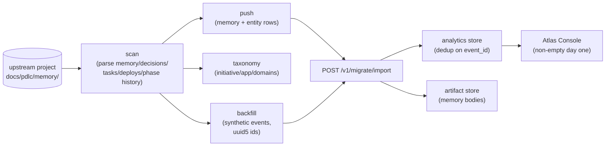

<!-- nav:top -->
[🏠 Wiki Home](README.md)

# Migration — importing an upstream pdlc project

`tools/pdlc-migrate/` is a Typer CLI that lifts an existing upstream **pdlc**
project (the file-based `docs/pdlc/memory/` methodology) into a pdlcflow tenant.
It runs in four steps — **scan → push → taxonomy → backfill** — and lands
everything through one engine endpoint, `POST /v1/migrate/import`. The payoff:
**Atlas Console dashboards are non-empty on day one**, and re-running the
migration is idempotent.



## CLI setup

The CLI reads target coordinates from options or env vars:

```bash
export PDLC_ENGINE_URL=http://localhost:8000
export PDLC_ORG_ID=00000000-0000-0000-0000-000000000000
export PDLC_PROJECT_ID=11111111-1111-1111-1111-111111111111
```

## Step 1 — `scan`

Inspects the upstream project and prints a manifest summary (counts only).

```bash
pdlc-migrate scan /path/to/upstream-project
```

`scan_project(root)` (`pdlc_migrate/scan.py`) reads `docs/pdlc/memory/`:
known memory files (`CONSTITUTION.md`, `STATE.md`, `INTENT.md`, `ROADMAP.md`,
`DECISIONS.md`, `METRICS.md`, `OVERVIEW.md`, `CHANGELOG.md`, `DEPLOYMENTS.md`),
episodes (`memory/episodes/*.md`), Beads tasks (`.beads/tasks.json`), and the
night-shift state file. The summary reports
`{memory_files, episodes, bd_tasks, deployments, night_shift_runs}`.

The same module hosts the **parsers** the import pipeline uses:

- `parse_decisions` — `## D-NNN — title` blocks → `{id, title, date, rationale}`.
- `parse_tasks` — `.beads/tasks.json` → `{external_id, title, labels, status}`
  (the upstream `id`, e.g. `bd-NN`, is preserved as `external_id`).
- `parse_deployments` — `DEPLOYMENTS.md` env blocks + history →
  `{env, tier, version, date}`.
- `parse_phase_history` — the `## Phase History` table in `STATE.md` →
  `{ts, event, phase, sub_phase, feature}`.
- `parse_roadmap` — `ROADMAP.md` → `{feature_name: F-NNN}`.
- `read_memory_files` — every `*.md` → `{kind, path, body}`.

## Step 2 — `push`

Sends the project's memory files + parsed entity rows to the engine.

```bash
pdlc-migrate push /path/to/upstream-project \
  --engine-url "$PDLC_ENGINE_URL" --org-id "$PDLC_ORG_ID" --project-id "$PDLC_PROJECT_ID"
```

`build_import_payload` (`push.py`, pure) assembles the shared import contract
from the scanned manifest: it reads memory-file bodies and delegates entity
extraction to the `parse_*` helpers. `push_payload` POSTs it to
`{engine_url}/v1/migrate/import` over httpx (a transport can be injected for
in-process hermetic tests via `httpx.ASGITransport`). The plain `push` command
ships memory files + entities with no taxonomy and no events (those are the next
two steps).

## Step 3 — `taxonomy`

Assigns the migrated project to an initiative / application / domains
(interactive).

```bash
pdlc-migrate taxonomy /path/to/upstream-project --engine-url "$PDLC_ENGINE_URL"
```

`assign_taxonomy` prompts for **initiative**, **application**, and
**domains** (comma-separated), then calls the pure `assign_taxonomy_core`. When
domains are left blank they are **derived** from Beads `domain:<name>` task
labels. The result is `{initiative, application, domains[]}` for the payload's
`taxonomy` block.

## Step 4 — `backfill`

Synthesizes a historical event stream so dashboards are populated immediately.

```bash
pdlc-migrate backfill /path/to/upstream-project \
  --engine-url "$PDLC_ENGINE_URL" --org-id "$PDLC_ORG_ID" --project-id "$PDLC_PROJECT_ID"
```

`backfill_events(root)` (`backfill.py`) reconstructs events from two sources:

- **Phase history** (`STATE.md`) — one event per row, classified by the
  `event` label: `*_start` → `phase.entered`, `deploy_succeeded` →
  `deploy.succeeded`, `operation_complete` → `session.closed`, else
  `subphase.entered`. The feature name is mapped to its `roadmap_id` via the
  roadmap parse.
- **Decisions** (`DECISIONS.md`) — one `decision.recorded` per decision.

Every synthesized event carries `payload.synthetic = True` (so the console can
distinguish reconstructed from live activity) and a valid `event_type`
(asserted against `EVENT_TYPES`). The `event_id` is a **deterministic uuid5** of
`(event_type, ts, roadmap_id/title)` — identical input always yields the
identical list.

## The import payload

`POST /v1/migrate/import` (`services/pdlc-engine/app/routes/migrate.py`) accepts:

```json
{
  "org_id": "…", "project_id": "…",
  "taxonomy": { "initiative": "Atlas", "application": "studio", "domains": ["frontend"] },
  "memory_files": [ { "kind": "CONSTITUTION", "path": "…", "body": "…" } ],
  "tasks":       [ { "external_id": "bd-12", "title": "…", "labels": ["domain:api"], "status": "done" } ],
  "decisions":   [ { "id": "D-1", "title": "…", "date": "2026-01-02", "rationale": "…" } ],
  "deployments": [ { "env": "staging", "tier": "nonprod", "version": "v1.0.0", "date": "…" } ],
  "events":      [ { "event_id": "…", "event_type": "phase.entered", "ts": "…",
                     "roadmap_id": "F-001", "user_story_id": null, "payload": { "synthetic": true } } ]
}
```

The route:

1. Turns each `events[]` entry into an `EventEnvelope`. Its `event_id` is a
   **deterministic uuid5** (seeded from the supplied `event_id`, else
   `event_type|ts`), and the taxonomy `domains` ride onto every envelope. The
   envelopes are `ingest`ed into the analytics store.
2. Persists each `memory_files[]` body via the artifact port at
   `migrated/{project_id}/{kind}.md`.
3. Returns per-kind counts:
   `{events, memory_files, tasks, decisions, deployments}` — where `events` is
   the **net new** count (`after - before` totals).

## Idempotency

Both layers dedup on `event_id`:

- **backfill** generates the identical event list (uuid5 from content) on every
  run, and
- the **analytics store** ignores any `event_id` it has already seen.

So a second `push`/`backfill` against the same project adds **zero** new events
(the import response reports `"events": 0`). This makes re-running safe — for
example after fixing a taxonomy assignment.

## Day-one non-empty dashboards

Because backfill replays the upstream phase history and decision log as
`synthetic:true` events tagged with the feature's `roadmap_id`, the Atlas
Console's **Live** feed, **Features** timeline, and roadmap/domain rollups all
have data the moment a project is migrated — no waiting for new activity.


---


---
<!-- nav:bottom -->
⏮ [First: Overview](01-overview.md) · ◀ [Prev: Monitoring & Analytics](14-monitoring.md) · [🏠 Home](README.md) · [Next: API Reference](16-api-reference.md) ▶ · [Last: Evals Framework](17-evals.md) ⏭
