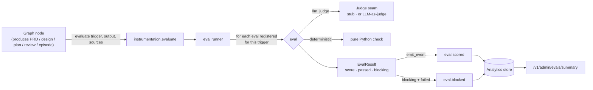

<!-- nav:top -->
[🏠 Wiki Home](README.md)

# Evals Framework

pdlcflow ships a small, extensible **evaluation harness** (Phase J) that measures the
quality of agent output at major steps of the lifecycle and guards against
**hallucination, ungrounded claims, and drift**. Evals run *in-process* alongside the
graph, score each meaningful output, and emit `eval.scored` / `eval.blocked` events into
the same clickstream that powers the Atlas Console — so eval results are queryable,
chartable, and auditable like any other telemetry.

> **Default posture: measure-only.** The harness is a **strict no-op unless enabled**
> (`PDLC_RUN_EVALS=true`). When on, evals *score and record* by default and never block;
> blocking is **opt-in per eval** (`PDLC_EVAL_BLOCKING=...`). This keeps the hermetic test
> suite and production flows untouched until you deliberately turn evaluation on.

## How it works



- A node that produces meaningful output calls one hook —
  `instrumentation.evaluate(trigger, state, output, target=..., sources=..., extra=...)`.
- The **runner** looks up every eval registered for that `trigger` and runs it. When the
  harness is disabled the runner returns `[]` immediately (zero overhead, zero events).
- **LLM-as-judge** evals call the **judge seam** (`evals.judge_port`). In CI/dev a
  deterministic stub answers (stable, explainable scores, no network); at boot the engine
  injects an LLM-as-judge backed by the provider factory at the configured **judge tier**
  (`PDLC_JUDGE_TIER`, needs `PDLC_WIRE_LLM=true`). **Deterministic** evals are pure Python.
- Each result is emitted as `eval.scored`; a failed **blocking** eval also emits
  `eval.blocked`. Both flow to the analytics store and surface at
  `GET /v1/admin/evals/summary` (avg score + pass rate, by eval and by agent).

### Where evals fire today (triggers)

| Trigger | Lifecycle step | Producing agent | Source(s) it's grounded against |
|---|---|---|---|
| `prd` | Inception · Define (PRD draft) | Atlas | brainstorm log |
| `design_docs` | Inception · Design (architecture/data-model/API) | Neo | architecture, feature |
| `plan` | Inception · Plan (task list) | Neo/Atlas | PRD / design |
| `review` | Construction · Party Review (REVIEW.md) | Neo | feature/build context |
| `episode` | Operation · Reflect (episode/retro) | Atlas | feature/run context |
| `deploy` | Operation · Ship (deploy-target selection) | Pulse | resolved tier + night-shift flag |
| `sentinel_relay` | Night-Shift (verdict relay) | Sentinel | the verbatim marker |
| `regression` | Golden-set CI / drift runs | any | committed golden reference |

> The `design_docs` and `plan` triggers also feed `spec_adherence`, which is grounded against
> the **PRD** (fetched from `prd_ref`) so it can check requirement coverage.

## Evals enabled in the starter

| Eval id | Dimension | Kind | Fires on | What it checks | Default |
|---|---|---|---|---|---|
| `agent_output_quality` | quality | LLM-judge | prd, design_docs, plan, review, episode | Per-agent output scored against the **persona's role rubric** (Atlas→PRD bar, Neo→design bar, …) | measure |
| `groundedness` | groundedness | LLM-judge | prd, design_docs, plan, review | Are the output's claims **supported by the sources**? (anti-hallucination / faithfulness) | measure (block-capable) |
| `citation` | citation | deterministic | prd, design_docs, plan | Does the output **reference the source artifacts** it was built from? | measure (block-capable) |
| `faithful_relay` | faithful_relay | deterministic | sentinel_relay | Sentinel relays the evaluator's reason **verbatim** — no paraphrase (audit integrity) | measure (block-capable) |
| `drift` | drift | deterministic | regression | Output **similarity to a committed golden reference**; a drop flags regression | measure |
| `spec_adherence` | correctness | LLM-judge | design_docs, plan | Does the design/plan **satisfy every PRD requirement + acceptance criterion** (no scope drift)? | measure (block-capable) |
| `prod_safety` | safety | deterministic | deploy | Deploy **never targets production under an autonomous night-shift run** (the prod-deploy ban, as a score) | measure (recommend blocking) |

These map 1:1 to the coverage requested: **per-agent output scoring** (`agent_output_quality`),
**hallucination/groundedness/faithfulness** (`groundedness`), **LLM-as-judge / rubric
scoring** (the judge seam + rubrics), **citation / faithful-relay enforcement** (`citation`,
`faithful_relay`), **drift detection / regression** (`drift` + the golden set), and **eval
CI** (the hermetic `evals` job).

## Enforcement (opt-in blocking)

- **Measure-only (default):** every eval records a score + emits `eval.scored`. Nothing is
  blocked. Use this to gather a baseline and tune thresholds.
- **Opt-in blocking:** set `PDLC_EVAL_BLOCKING=groundedness,citation` to mark those evals
  blocking. A failed blocking eval emits `eval.blocked`. A node that wants hard enforcement
  inspects the results and refuses to proceed:

  ```python
  from pdlc_graph.instrumentation import evaluate
  from pdlc_graph.evals import blocking_failures

  results = evaluate("prd", state, prd_md, target="atlas", sources={"brainstorm_log": log})
  if blocking_failures(results):
      # keep the gate open / route to a fix step instead of approving
      ...
  ```

  In autonomous **night-shift** runs this is where a blocking failure becomes an abort
  signal — the strongest place enforcement matters. (The starter ships the mechanism +
  events + config; wiring a hard gate-halt is a one-line opt-in per gate, intentionally
  left off by default so flows stay stable until you choose to enforce.)

## Configuration

| Env var | Default | Effect |
|---|---|---|
| `PDLC_RUN_EVALS` | `false` | Master switch. Off = strict no-op. |
| `PDLC_JUDGE_TIER` | `opus` | LLM tier for the LLM-as-judge (resolved via the provider factory). |
| `PDLC_WIRE_LLM` | `false` | When also true, the judge uses a real model; otherwise the deterministic stub judge is used. |
| `PDLC_EVAL_BLOCKING` | `` (empty) | Comma-separated eval ids forced to block their gate on failure. |

## Viewing results

- **Events:** `eval.scored` and `eval.blocked` land in the events stream (40-event taxonomy).
- **API:** `GET /v1/admin/evals/summary?org_id=...` → `{ by_eval: {id: {n, avg_score, pass_rate}}, by_agent: {...} }` (org-scoped; cross-org banned → 403).
- **CI:** the hermetic `evals` job runs the harness end-to-end with the deterministic stub judge (`pytest -m eval`).

## Golden suite, drift tracking & the nightly run

A **golden suite** (`pdlc_graph/evals/golden/suite.json`) is a set of fixed
`(trigger, output, sources/extra)` cases run through every eval. The committed
**baseline** (`suite_baseline.json`) records the expected score per `case::eval`.

- **Locally / in CI (deterministic):** `scripts/run_eval_suite.py` scores the suite with
  the stub judge and **fails on any regression vs the baseline** — so a code change that
  shifts a deterministic score is caught. This also runs as a hermetic test
  (`test_golden_suite_has_no_drift_vs_baseline`) in the `evals` CI job.
  ```bash
  uv run python scripts/run_eval_suite.py --fail-on-regress 0.0   # drift check
  uv run python scripts/run_eval_suite.py --write-baseline        # after an intentional change
  ```
- **Nightly (real model):** `.github/workflows/evals-nightly.yml` runs on a daily cron:
  - **`drift` job** — hermetic; the regression guard above + uploads `eval-report-stub.json`.
  - **`real` job** — wires the **real LLM-as-judge** (`--real`) and scores the suite with an
    actual model, uploading `eval-report-real.json` + a job summary. **Report-only** (LLM
    variance is expected; it doesn't hard-fail). Drift-over-time = the per-run artifacts.

### Enabling the real-LLM nightly

It's **off until you opt in** (so forks/CI never need credentials):

1. Set repository **variable** `RUN_REAL_EVALS=true` (and optionally `PDLC_DEFAULT_LLM_PROVIDER`,
   `PDLC_JUDGE_TIER`, `AWS_REGION`).
2. Add provider **secrets** (`AWS_ACCESS_KEY_ID`, `AWS_SECRET_ACCESS_KEY` for Bedrock; or the
   equivalents for your configured provider).
3. Trigger it via the **Actions → evals-nightly → Run workflow** button, or wait for the cron.

For richer trend analysis, push `eval-report-real.json` to a store (S3 / a metrics DB) and
chart `scores` over time — a documented next step beyond the per-run artifacts.

## Recommended evals to enable next

This is an agentic **SDLC** framework, so quality, safety, and traceability all matter.
A pragmatic roadmap beyond the starter:

> ✅ Already shipped: **spec-adherence** (`spec_adherence`) and **prod-safety** (`prod_safety`).

**Correctness & grounding**
- *Requirement-coverage* — every `MUST` requirement maps to ≥1 task and ≥1 test.
- *Cross-artifact consistency* — PRD ↔ design ↔ tasks ↔ tests don't contradict each other.
- *Code-grounded claims* — review/episode statements trace to the actual diff (not invented).

**Safety & policy**
- *Security-finding precision/recall* — Phantom's findings vs a labeled set (no false alarms, no misses).
- *PII/secret leakage* — outputs/events contain no secrets or PII.
- *Prompt-injection resistance* — agents ignore injected instructions in source artifacts.

**Process integrity**
- *Gate-decision soundness* — auto-approved (night-shift) gates would also pass a human rubric.
- *TDD honesty* — a real RED preceded each GREEN (tests written first).
- *Test meaningfulness* — generated tests actually assert behavior (mutation-style check).

**Reliability & cost**
- *Determinism/variance* — re-running the same step yields stable output (low variance).
- *Drift-over-time* — golden-set scores tracked release-over-release with alerting.
- *Latency & token budget* — per-step cost within budget (you already emit `llm.tokens_spent`).

**UX & docs**
- *UX-law conformance* — Muse output obeys the design laws.
- *Doc-freshness* — Jarvis docs don't drift from the implementation.

Start them in **measure-only**, collect a baseline, set thresholds from the observed
distribution, then promote the highest-value few (groundedness, security, prod-safety) to
**blocking**.

## How to add a new eval

1. **Write the check** in `packages/pdlc-graph/pdlc_graph/evals/checks/<name>.py` as a
   function `(EvalContext, EvalSpec) -> EvalResult`. Use `judge(...)` for LLM-scored evals
   or pure Python for deterministic ones.
2. **Register it** at import time:
   ```python
   register(EvalSpec(
       eval_id="spec_adherence", dimension="correctness", kind="llm_judge",
       triggers=frozenset({"design_docs", "plan"}), threshold=0.7, blocking=False,
       fn=_run, description="Does the design satisfy every PRD acceptance criterion?",
   ))
   ```
   and import it from `evals/checks/__init__.py` so registration happens.
3. **Add a rubric** (for LLM-judge evals) in `evals/rubrics.py`.
4. **Emit the output at the right step** — if the trigger is new, add one
   `evaluate("<trigger>", state, output, target=..., sources=...)` call in the producing node.
5. **Add a golden fixture** (for drift/regression) under `evals/golden/` and a test in
   `tests/test_evals.py` (mark it `@pytest.mark.eval`).
6. **(Optional) make it blocking** by adding its id to `PDLC_EVAL_BLOCKING`.
7. Run `pytest -m eval` locally; the `evals` CI job runs it on every push.

## Honest limitations

- The **stub judge is not a quality signal** — it's a deterministic placeholder so the
  harness + CI run hermetically. Real scoring requires `PDLC_RUN_EVALS=true` **and**
  `PDLC_WIRE_LLM=true` with model credentials.
- `drift` uses **word-overlap (Jaccard)**, not semantic similarity — swap in embeddings for
  production drift detection.
- Blocking ships as **config + events + helper**; hard gate-halting is a deliberate one-line
  opt-in per gate (off by default).
- The **eval CI job** validates wiring + deterministic evals; **real-LLM eval runs** (and
  drift-over-time) are best run on a schedule with credentials (a documented next step).


---
<!-- nav:bottom -->
⏮ [First: Overview](01-overview.md) · ◀ [Prev: API Reference](16-api-reference.md) · [🏠 Home](README.md) · [Next: Home](README.md) ▶ · [Last: Evals Framework](17-evals.md) ⏭
