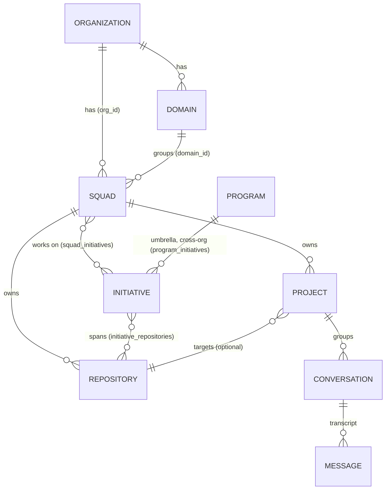

[← Back to the Wiki index](README.md)

# Data Model & Hierarchy

How the core entities — **Org, Domain, Squad, Repository, Initiative, Program,
Project, Conversation** — relate to each other, and how that maps to tenant
isolation (RLS).

> Two different ideas are at play and it helps to keep them apart:
> - **Tenancy** — *almost every row carries an `org_id`* and is **RLS-FORCE**d, so a
>   database session only ever sees its own org's rows. This is the security boundary.
> - **Hierarchy** — the *business* relationships below (Domain→Squad, Squad→Repo, …).
>   These are foreign keys / join tables layered on top of the tenancy.

## The picture

## The entities

| Entity | Belongs to | Key relationships |
|---|---|---|
| **Organization** | — (tenant root) | The isolation boundary. Everything below is `org_id`-scoped + RLS-FORCE'd. |
| **Domain** | Org | A cross-cutting area (e.g. *Payments*, *Identity*). Parent of squads. |
| **Squad** | Org (`org_id`), optionally a Domain (`domain_id`) | Owns **repositories** and **projects**; linked to **initiatives** many-to-many. |
| **Repository** | Squad | A GitHub repo (url + default branch). Its access token is stored via the [secrets backend](03-configuration.md#secrets-per-repo-vcs-tokens), never in plaintext. Referenced by initiatives (M:N) and optionally by a project. |
| **Initiative** | Org | A funded body of work. Many-to-many with **squads** and with **repositories** — so an initiative can span several squads and repos within the org. |
| **Program** | — (cross-org umbrella) | Links initiatives **across orgs**. Initiatives stay org-scoped; the Program is the only shared object (see below). |
| **Project** | Squad (required), optionally a Repository | pdlcflow's **internal grouping of conversations** (also owns tasks, memory files, approval gates). |
| **Conversation** (thread) | Project | A single LangGraph thread — `thread_id = "org:project:session"`. Its verbatim transcript + checkpointed state are durable and RLS-isolated. |

## How a user's stated model maps

> *"Orgs have multiple domains; each domain has multiple squads; each squad can have
> multiple GitHub repos; one or more squads can work on one or more initiatives; an
> initiative can span multiple repos, squads, domains, and orgs; and 'project' is an
> internal concept that groups conversations."*

- **Org → many Domains** ✅ `domains.org_id`
- **Domain → many Squads** ✅ `squads.domain_id` (nullable — a squad may be ungrouped)
- **Squad → many Repos** ✅ `repositories.squad_id`
- **Squads ↔ Initiatives (M:N)** ✅ `squad_initiatives`
- **Initiative spans repos / squads** ✅ `initiative_repositories` + `squad_initiatives`
- **Initiative spans multiple ORGS** ✅ — but via a **Program** umbrella, not a single
  cross-org initiative row (that would break per-org RLS). See next section.
- **Project = grouping of conversations** ✅ `projects` + threads keyed by project.

## Cross-org initiatives — the Program umbrella

A single initiative can't literally span orgs without breaking the "a session only
sees its own org" guarantee. So instead:

- Each **Initiative** stays **org-scoped** (RLS-clean).
- A **Program** is a shared object that links org-scoped initiatives across orgs via
  `program_initiatives` (each link tagged with its initiative's `org_id`).
- **Visibility (RLS):** a Program is readable by its **owner org** *and* by any org
  that has a **linked initiative**; writes are owner-only. Each org sees **only its
  own** `program_initiatives` links — so orgs share the *program* without leaking
  *which* of another org's initiatives belong to it.

The net effect is "an initiative spans orgs" at the program level, with strict
per-org isolation preserved underneath. (Verified against real Postgres: owner +
linked orgs see the program; unrelated orgs see nothing; per-org links stay private.)

## Conversations, attachments & memory

- A **Conversation** is a LangGraph thread under a **Project**. The verbatim
  transcript (`thread_transcript`) and the checkpointed graph state are both
  RLS-FORCE'd — see [Monitoring](14-monitoring.md) and the Studio's conversation
  history ([Studio](13-studio.md)).
- **Chat attachments** are stored under the tenant artifact namespace at
  `uploads/{conversation}/{timestamp}-{nonce}-{filename}` (so re-uploading the same
  name in a conversation never overwrites). Text files and extractable docs
  (pdf/docx/xlsx/pptx) have their text folded into the prompt, so the file reaches
  whichever agent runs the turn.
- **Repo-backed memory** reads files from the Squad's connected **Repository** via the
  GitHub API (token resolved through the secrets backend) — shown in the Studio only
  once a repo is selected.

## Where this lives

- Models: `services/pdlc-engine/app/db/models.py`
- Schema + RLS: migrations `0001`–`0006` (`…/db/migrations/versions/`)
- CRUD APIs: [`/v1/domains|squads|initiatives|repositories|projects`](16-api-reference.md#entities)
- Studio nav (Org · Domain · Squad · Repo · Initiative · Project): [Studio](13-studio.md)
