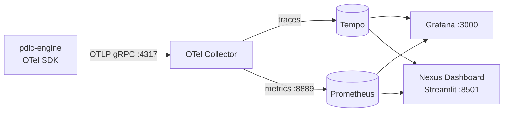

<!-- nav:top -->
[🏠 Wiki Home](README.md)

# Observability — OpenTelemetry, Grafana & the Nexus Dashboard

pdlcflow emits **OpenTelemetry** traces and metrics for every graph turn, node,
and LLM call, exports them to an **OTel Collector**, and fans them out to
**Tempo** (traces) and **Prometheus** (metrics). Two read surfaces sit on top:

- **Grafana** (`:3000`) — prebuilt time-series dashboards + trace search.
- **Nexus Dashboard** (`:8501`) — a **Streamlit** ops console with a
  pdlc-workflow-shaped view (agent activity, token/cost, gate activity, and a
  per-thread trace explorer).

> This is the **operational** telemetry layer. It complements — it does **not**
> replace — the tenant **business analytics** in the React
> [Nexus Console](14-monitoring.md): per-org tokens/USD and phase rollups stay
> in Postgres behind RLS, because billing-grade per-tenant numbers must not live
> only in a trace backend. Two pipes, each authoritative for its own data.

Everything here is **opt-in and off by default** — with `PDLC_OTEL_ENABLED`
unset, the graph's tracer port is a no-op and behaviour is byte-identical, so
CI and hermetic dev stay network-free.

---

## Signal model

A pdlc **thread** is not a trace: it lives across many turns and human pauses
(approval gates, question rounds) that can last hours or days. So we open **one
trace per turn** and correlate turns by the `pdlc.thread_id` span attribute. The
long-horizon "thread journey" is reconstructed by querying the Postgres
clickstream/transcript, not by holding a span open across a pause.

```
pdlc.turn                       (root span — one per graph turn)
  ├─ pdlc.node.discover          (one span per LangGraph node …)
  │    └─ pdlc.llm.atlas         (   … and one per complete() call:
  │                                  GenAI semconv — model, provider,
  │                                  token usage, estimated cost)
  ├─ pdlc.node.define
  │    └─ pdlc.llm.atlas
  └─ …
```

The span tree **is** the "across multiple agents" view: each node/persona is a
span, nested under the turn, with the LLM call as the leaf.

### Where the spans come from

| Span | Emitted by | Notes |
|------|-----------|-------|
| `pdlc.turn` | `app/runtime/graph_runner.py` (`turn_span`) | root; carries `pdlc.thread_id/org_id/project_id` |
| `pdlc.node.*` | `pdlc_graph/instrumentation.py` via the **dep-free tracer port** (`pdlc_graph/tracing.py`) | the engine injects an OTel-backed tracer at boot; no-op otherwise |
| `pdlc.llm.*` | `app/runtime/llm_backend.py` (`llm_span`) | GenAI semconv: `gen_ai.system`, `gen_ai.request.model`, `gen_ai.usage.input_tokens/output_tokens`, `pdlc.cost_usd` |
| `http…` | FastAPI instrumentation | server request spans (excludes `/health`) |

### Metrics (→ Prometheus)

| Metric | Type | Labels |
|--------|------|--------|
| `pdlc_turns_total` | counter | `outcome` (paused/completed/error) |
| `pdlc_turn_duration_ms` | histogram | `outcome` |
| `pdlc_llm_calls_total` | counter | `persona, provider, model, tier, status` |
| `pdlc_llm_tokens_total` | counter | `persona, provider, model, direction` (in/out) |
| `pdlc_llm_cost_usd_total` | counter | `persona, provider, model` |
| `pdlc_llm_duration_ms` | histogram | `persona, provider, model` |
| `pdlc_gates_total` | counter | `kind, action` (opened/resolved) |

---

## Architecture



All of this ships as an **opt-in compose profile** (`observability`) in both the
self-host (`infra/compose`) and standalone (`deploy/`) stacks. Config lives under
`observability/` next to the compose file.

---

## Enabling it

### One-line / standalone install (`deploy/`)

The installer already fetched the `observability/` configs. Turn it on with the
control CLI:

```bash
pdlcflow observability up      # sets PDLC_OTEL_ENABLED=true + starts the stack
pdlcflow observability status  # show the observability containers
pdlcflow observability down    # stop them + disable OTel export
```

Under the hood that is: set `PDLC_OTEL_ENABLED=true` in `.env`, then
`docker compose --profile observability up -d` (which recreates `api`/`worker`
so they pick up the flag).

### From a repo clone (`infra/compose`)

```bash
cd infra/compose
echo "PDLC_OTEL_ENABLED=true" >> .env
docker compose --profile observability up -d
```

### Accessing the dashboards

| Surface | URL | What you get |
|---------|-----|--------------|
| **Nexus Dashboard** (Streamlit) | http://localhost:8501 | KPIs, agent activity, token/cost, gate activity, **thread trace explorer** |
| **Grafana** | http://localhost:3000 | the provisioned **“pdlcflow — PDLC Workflow & Agents”** dashboard + Tempo trace search (anonymous admin, no login) |
| Prometheus | http://localhost:9090 | raw metric queries |
| Tempo | http://localhost:3200 | trace API (used by Grafana/Nexus) |

> Metrics/traces appear once the engine actually runs a turn with OTel enabled.
> An empty dashboard just means no turns have happened yet.

### Using the trace explorer

In the Nexus Dashboard, paste a **thread id** (`org:project:session` — copy it
from the Studio URL or the `/v1/admin/threads` API) into *Thread trace explorer*
to pull that thread's per-turn traces from Tempo and drill into the agent span
tree (node → persona → model, with token counts and latency).

---

## Configuration

| Env var | Default | Purpose |
|---------|---------|---------|
| `PDLC_OTEL_ENABLED` | `false` | master switch — off ⇒ tracer port is a no-op |
| `PDLC_OTEL_SERVICE_NAME` | `pdlc-engine` | `service.name` resource attribute |
| `PDLC_OTEL_ENDPOINT` | `http://otel-collector:4317` | OTLP/gRPC collector endpoint (standard `OTEL_EXPORTER_OTLP_ENDPOINT` is also honoured) |
| `PDLC_OTEL_CONSOLE_EXPORT` | `false` | also print spans/metrics to stdout (debug without a collector) |
| `PDLC_OTEL_METRIC_INTERVAL_S` | `15` | metric export cadence (seconds) |
| `PDLC_OTEL_INSTRUMENT_FASTAPI` | `true` | add server-side HTTP request spans |

Nexus Dashboard env (set on the `nexus-dashboard` service):
`PROMETHEUS_URL`, `TEMPO_URL`, `GRAFANA_URL`.

---

## Security & tenancy

- The Grafana + Streamlit surfaces are **internal ops tools** with no per-org
  auth — keep their ports (`3000`, `8501`, `9090`, `3200`) bound to localhost or
  behind your own reverse proxy / VPN. Do **not** expose them publicly.
- Span attributes include `pdlc.org_id/project_id/thread_id` so ops can slice by
  tenant, but they are **not** an RLS boundary. Customer-facing, per-org
  analytics remain the RLS-scoped [Nexus Console](14-monitoring.md) API.
- Prompts and completions are **not** attached to spans — only metadata (model,
  token counts, latency, cost). Nothing customer-content-bearing leaves for the
  trace backend.

## Cost & retention

Tempo keeps traces **48h** by default (`compactor.block_retention` in
`observability/tempo.yaml`); raise it or point `storage.trace.backend` at
`s3`/`gcs` for scale. Prometheus uses its default local retention. All three
backends persist to named volumes (`tempodata`, `promdata`, `grafanadata`),
removed only by `pdlcflow wipe` / `uninstall --data`.

## How it stays hermetic

The graph package (`pdlc-graph`) has **no** OpenTelemetry dependency. It calls a
tiny injectable **tracer port** (`pdlc_graph/tracing.py`) whose default is a
no-op — exactly like the existing `set_emitter` / `set_completion_backend`
seams. Only the engine depends on the OTel SDK, and only
`app/observability/tracing.py` configures it, guarded by `PDLC_OTEL_ENABLED`. So
tests and offline dev run with zero telemetry overhead and identical output.

---

[← Data Model & Hierarchy](18-data-model.md) · [🏠 Wiki Home](README.md)
