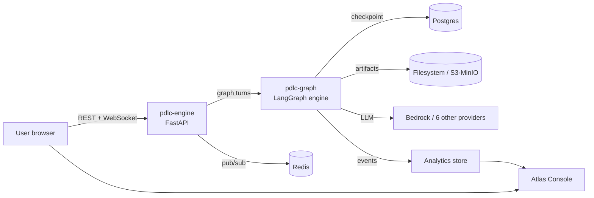

# pdlcflow Wiki

**pdlcflow** is PDLC (the Product Development Lifecycle) reimagined as a stand-alone
**LangGraph + AWS Bedrock SaaS** with a browser UI, pluggable LLM providers, clickstream
telemetry, and an admin dashboard — runnable self-host via Docker Compose.

This wiki walks you through installing, launching, using, and monitoring the infrastructure,
the **core PDLC flow** (Inception → Construction → Operation), and the **specialized flows**
(Night-Shift autonomy, the utility commands, the 10-agent party meetings, and migration).

## Contents

| # | Page | What's inside |
|---|------|---------------|
| 1 | [Overview & Architecture](01-overview.md) | What pdlcflow is, components, how the pieces fit |
| 2 | [Installation](02-installation.md) | Prerequisites, Docker Compose, migrations, MinIO |
| 3 | [Configuration & Backends](03-configuration.md) | Env flags, in-memory vs Postgres/Redis/S3, self-host vs SaaS |
| 4 | [Launching & Health](04-launching.md) | Bringing the stack up, dev mode, health checks |
| 5 | [Core PDLC Flow](05-core-flow.md) | The 4 phases, the 8 approval gates, meta-graph routing |
| 6 | [The Agents (Personas)](06-agents.md) | The 10 personas, roles, model tiers, auto-selection |
| 7 | [Party Mode](07-party-mode.md) | The party orchestrator + every party type, triage, MOM |
| 8 | [Inception](08-inception.md) | Discover → Define → Design → Plan, Socratic/Sketch, visual companion |
| 9 | [Construction](09-construction.md) | TDD loop, 3-Strike → Strike Panel, the 7 test layers |
| 10 | [Operation](10-operation.md) | Ship → Verify → Reflect, semver, deploy, the prod-deploy ban |
| 11 | [Night-Shift](11-night-shift.md) | The autonomous runtime, contract party, Sentinel, mission control |
| 12 | [Utility Commands](12-utilities.md) | /decide /doctor /whatif /pause /resume /abandon /release /override /rollback /hotfix |
| 13 | [Using the Studio](13-studio.md) | The browser UI: chat, gates, visual companion, mission control |
| 14 | [Monitoring & Analytics](14-monitoring.md) | Telemetry, the Atlas Console rollups, the cross-org ban |
| 15 | [Migrating an upstream project](15-migration.md) | scan / push / taxonomy / backfill |
| 16 | [API & WebSocket Reference](16-api-reference.md) | Every REST endpoint + the thread WebSocket |

---

[Start → Overview & Architecture](01-overview.md)
